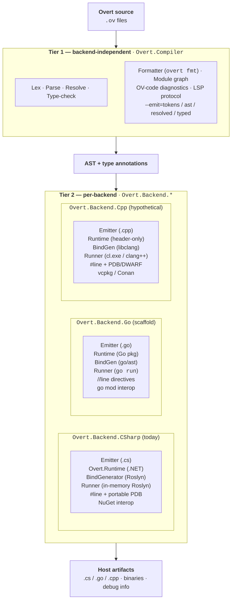

# Overt — Design Notes

A working design document for a programming language optimized for agentic (LLM-driven) authorship and maintenance, rather than human authorship. Captures decisions, rejected options, and rationale so future sessions can pick up cold.

**Project name:** Overt. **File extension:** `.ov`. The name *is* the design philosophy — every effect, error, dispatch, mutation, and piece of state is *overt*: visible at the call or declaration site, never concealed from the reader.

---

## 1. Thesis

Every existing programming language is designed for humans. Machine code is for computers; assembly is a thin wrapper; C/C++/compiled and interpreted/JIT languages are progressively thicker wrappers for human readability and reasoning. Control structures, OO, short names, and implicit conventions are all scaffolds around the limits of human cognition.

LLMs have different cognitive characteristics than humans, so a language authored primarily by agents should be designed around those differences — not inherit the compression and implicitness that exists because humans have small working memory.

A human auditor still has to read the code, so the target is not "unreadable by humans." The target is: **optimized for the agent, tolerable for the auditor.** A different point on the curve than any existing language.

---

## 2. The central inversion

Current languages compress because human working memory is small. LLMs have the opposite problem — large context, but weak causal tracking across calls. The language design should invert the usual tradeoffs:

| Human-optimized languages | Agent-optimized language |
|---|---|
| Short, terse names | Verbose, self-documenting names |
| Implicit effects (exceptions unwind, ambient state) | Effects declared in every signature |
| Types inferred and hidden | Types restated at use-sites; redundancy is a feature |
| Positional arguments | Named-only binding everywhere |
| Stack traces (what called what) | Causal traces (what derived what) |
| Errors point to a location | Errors explain what was expected and why the mismatch occurred |
| Conventions, idioms, "pythonic" style | One canonical form, formatter-enforced; no style choices |

---

## 3. What to drop and what to keep

**Keep** (not a human-only crutch):

- **Structured programming / block-scoped control flow** — gives code a parseable CFG shape that helps *any* reasoner, LLM or human. Training data priors reinforce it. Dropping it would hurt agents, not help.
- **Static typing** — types are redundancy the agent can use to self-check.
- **Indentation and visible structure** — agents' training corpus is saturated with it.
- **Ordinary variable names.** Some agent-first experiments (e.g., Vera; see §23) replace names with typed De Bruijn indices on the theory that naming is where LLMs fail. Public feedback on that choice is negative for read-time ergonomics. Overt keeps names.

**Drop** (human scaffolds or implicit surprises):

- **OO data/behavior bundling** — nouns-with-methods is a human mental-model crutch. Prefer explicit data + transformations.
- **Exceptions that unwind invisibly** — control flow that isn't visible at the call site costs tokens to re-derive.
- **Positional arguments and positional destructuring** — off-by-one is the dominant LLM failure mode. Everything named.
- **Variable shadowing** — every name has one binding per scope.
- **Zero values and implicit nil** — surprises an agent has to remember to check for.
- **Hidden dispatch** — interface satisfaction by coincidence, duck typing, automatic conversions.
- **Reflection** — the ultimate form of hidden dispatch. Defeats static typing and makes refactoring dangerous. Detailed in §15.
- **User-defined macros / procedural metaprogramming** — lets each codebase invent a bespoke dialect. Catastrophic for training priors. Detailed in §15.

**Guiding principle:** the thing to strip is *implicitness*, not structure. Every surprise costs tokens the agent has to spend re-deriving what's happening.

---

## 4. Token economics and one canonical form

The pragmatic reality in 2026 is that agents cost tokens, so the language cannot be reckless with verbosity. But the right metric is not *tokens per line of code* — it is *tokens per correct unit of work delivered.* Framed that way, token economics and agent-friendliness align more than they diverge.

**Three token budgets, not one:**

1. **Write-time** — the agent producing code. Paid once per line.
2. **Read-time / edit-time** — the agent loading context to understand or modify existing code. Paid every time someone touches the file.
3. **Debug-time** — the agent diagnosing something broken. Paid only when things go wrong, but multiplicative in cost: reread, trace, iterate, re-test.

For any code that lives past its first write, read-time dwarfs write-time. For any code with real bugs, debug-time dwarfs both combined. A language that is 1.5× more verbose at write-time but cuts debug cycles by 3× is token-positive. That is the central calculation.

**Design choices that earn their tokens back:**

- **Exhaustive pattern matching** — a handful of extra tokens at write-time, prevents entire classes of "why did this case fall through" debug sessions.
- **`Result<T, E>` + `?` propagation operator** — shorter than equivalent try/catch at every call site, and eliminates "what can this throw" context pulls.
- **Effect rows in signatures** — the agent reads one line instead of loading a whole function body. Compounds per call.
- **Non-nullable by default** — every null-deref bug that does not happen is a debug session that does not happen.
- **One canonical form** — no reasoning across style alternatives; large savings in chain-of-thought, not just output tokens.
- **Self-describing signatures** — fewer standalone docs to maintain, less documentation drift, less context to pull when editing.

**The "one canonical form" rule, stated sharply:**

One way per semantic purpose. Zero ways for purposes our semantics do not have. When two forms do the *same thing* differently, we pick one. When they do *semantically different* things, we keep both and make the distinction visible.

Consequences throughout the language:

- **`if` is an expression.** No ternary. `let x = if cond { a } else { b }`. The `else` arm is **optional in statement position**: `if cond { body }` is sugar for `if cond { body } else { () }`, and the then-block's value-type must be `()`. An `if` used for its value (e.g., on the right-hand side of `let`) must have both arms with matching types — enforced by the type checker.
- **No `if let`** — `match` handles all pattern-driven branching.
- **One loop per semantic purpose:** `for each` (collection), `while` (condition), `loop` (infinite). Not redundant — each has a distinct meaning.
- **One equality operator:** `==` means structural equality. No reference-identity operator. No separate `.equals()` method.
- **One string formatting form:** interpolation (`"Hello, $name!"`, `"${price * 1.08}"`). No `printf`, no separate template literals.
- **If an argument name can be elided, it must be.** Single-parameter unambiguous calls take the bare value; multi-parameter or type-ambiguous calls name every argument. No optional-ness either way.
- **No construction shorthand** (no Rust-style `User { name }` when a local binding has the same name). Always `User { name = name }`.

**Levers specifically for token thrift, within the design philosophy:**

- **Short canonical names for the most-common types.** `Option`, `Result`, `List` — not `NullableValue`, `FailableComputation`. Verbosity is reserved for domain types; core primitives get brief canonical names.
- **Prelude / auto-import for core constructors and combinators.** `Some`, `None`, `Ok`, `Err` available without per-file import ceremony.
- **Terse punctuation for highest-frequency operations.** `?` for `Result` propagation, `=>` for match arms, `|>` for pipe composition, `|>?` for pipe-with-propagation, `!{...}` for effect rows. Ceremony stays short where the agent writes it constantly.
- **Compiler diagnostics designed for agent consumption.** One actionable sentence plus a location, not a wall of context. The compiler's token budget counts too.

**Forward-looking caveat:** token prices have fallen roughly 10× over two years, and the trend is not stopping. This section's constraints are real today but transitional. As costs continue to fall, the calculus shifts further toward "verbose wherever it buys a correctness check." The levers above are right for the current era; the underlying principle — tokens-per-correct-unit-of-work — is durable.

### Canonical-form tie-breaker: fewer implicit transformations per line

When two equivalent forms compute the same value and Overt must pick one as canonical, **prefer the form with fewer implicit transformations per line**, even when the alternative is terser.

This is where Overt's design instinct differs most sharply from languages designed for humans. Human language design typically optimizes for reducing *visual noise* — fewer characters, fewer lines, fewer named intermediates, chained compositions that read "naturally" left-to-right. That instinct is correct for humans, who pattern-match fluidly on visual shape and track state cheaply across a short span of text.

LLM agents have the inverse profile. They pattern-match *extremely* well on lexical shape but track state poorly across function calls and implicit transformations. Every implicit operation per line — a positional splice in a pipe, a type coercion driven by inference, an exception-like early return buried inside an operator — is a tax the agent pays in mental simulation, and it's exactly the kind of tax that produces subtle bugs at modification time.

Concrete example. Computing the same result three ways:

```overt
// Three lets — verbose; zero implicit transformations per line.
let b1: StringBuilder = sb.new_()
let b2: StringBuilder = sb.append_string(self = b1, value = "hello ")?
let b3: StringBuilder = sb.append_string(self = b2, value = "world")?
let result: String = sb.to_string(b3)?

// Pipe chain — terse; two implicit transformations per arrow
// (positional splice + `|>?` unwrap).
let result: String =
    sb.new_()
      |>? sb.append_string(value = "hello ")
      |>? sb.append_string(value = "world")
      |>? sb.to_string
```

The pipe form is fewer tokens and reads "fluidly" to a human. The three-let form is what an agent will get right more often. That's the priority order, and it flips the usual preference.

**Implications:**

- Where two constructs overlap, the tie-breaker is explicitness-per-line, not token count.
- Verbosity that eliminates implicit behavior is *worth* the tokens. This is a sharper restatement of §2's central inversion.
- Inherited reader-facing conventions from human languages (pipe chains, implicit returns, point-free style, heavy type inference) need positive justification to stay — "elegant" isn't one.

A preliminary finding to this effect is logged in [`CARRYOVER.md`](CARRYOVER.md) under "Agent-RWRA findings and hypotheses" as H1. Validation requires real agent-authored Overt programs; until then the principle above is directional, not a basis for stripping existing features.

---

## 5. Semantic primitives (decided)

Three axes determine everything else. All three are now settled:

1. **Concurrency model** — structured concurrency via `parallel`, `race`, and `par_map`. Detailed in §12.
2. **Error model** — `Result<T, E>` with the `?` propagation operator and causal chains. Detailed in §11.
3. **Collections and iteration** — named high-level operations (`for each`, `fold`, `map`, `filter`, `first`, `last`, `chunks`, `windows`, `zip`, `scan`) as the surface. Source-level integer indexing is banned; detailed in §13.

Additional first-class concepts:

- **Causal traces** — first-class, via `trace` blocks. Detailed in §14.
- **Mutation** — immutable by default; `let mut` for rebinding, `with` for record copy-modification. Detailed in §10.
- **Provenance / taint** — deferred past v1; implementable as a library initially, promoted to first-class later if needed.
- **Executable natural-language specs** — deferred past v1; open question.

---

## 6. Syntax family

**Decision: C-family surface, ML-family semantics.**

Curly braces, statement terminators, familiar block structure. This is where agents have the deepest training priors and the largest corpus — going against those priors makes the agent slower and more error-prone. Rust is the existing point closest to this target: C-ish surface, ML-ish soul.

Grafted on from the ML family:

- Expressions over statements (most constructs yield values)
- Pattern matching as a first-class construct with compiler-enforced exhaustiveness
- Sum types (tagged unions / discriminated unions)
- Immutable-by-default bindings; mutation opt-in via `let mut` (§10)

**Explicit rejections:**

- Indentation-sensitive scoping — ambiguity is an agent failure mode
- S-expressions — reviewer-hostile and thin training corpus
- Optional semicolons — ambiguity is the enemy

---

## 7. Surface syntax

Concrete keywords and literal forms.

**Keywords:**

- `fn` — function declaration (shorter than `func`/`function`; Rust priors)
- `let` — immutable binding (§10)
- `let mut` — mutable binding; rebinding allowed (§10)
- `with` — record copy-with-modification expression (§10)
- `record` — product type declaration (§9)
- `enum` — sum type declaration (§9)
- `match` — pattern matching
- `if`, `else` — expression form only
- `for each`, `while`, `loop` — iteration constructs
- `return` — explicit early return (last expression is the default return)
- `use` — import; `use stdlib.{http, json}`
- `module` — module declaration (one per file; filename is the module name)
- `pub` — visibility modifier; module-private by default
- `parallel`, `race` — task-group blocks (§12)
- `trace` — execution trace block (§14)

**Entry point:**

```
fn main() !{io} -> Result<(), IoError> {
    // ...
}
```

Every program has a `main` that returns `Result<(), E>`. Non-`Ok` return is the program's exit failure.

**Effect rows:**

Between the parameter list and the return arrow, bang-prefixed brace list:

```
fn fetch(url: String) !{io, async} -> Result<String, HttpError> { ... }
```

Empty effects omit the marker. Core effects in v1: `io`, `async`, `inference`. `fails` is implied by any `Result` return and never written explicitly.

**`inference`** fires on any call that invokes an external large language model or other AI inference service. Its inclusion follows from Overt's agent-first thesis: agents call other models, and the pipeline signature should say so. A call site that doesn't satisfy `inference` in its own row cannot invoke a function that requires it. Borrowed from Vera (§23).

**Explicit everywhere.** Every function's effect row is declared on the signature. The compiler checks that the body's effects are a subset of the declared row. There is no inference at signatures — this reaffirms and extends §8's general rule against signature-level inference.

Rationale: a call site should tell the caller what the callee does without loading the body. When a helper gains an effect (for example, starts touching the filesystem), every caller's signature must update to match; that cascade is a *feature*, making the effect boundary visible at diff-read time.

**Effect-row type variables** for higher-order functions. When a function's effect row depends on a callback, declare an effect-row variable and propagate it:

```
fn map<T, U, E>(list: List<T>, f: fn(T) !{E} -> U) !{E} -> List<U> { ... }
fn filter<T, E>(list: List<T>, pred: fn(T) !{E} -> Bool) !{E} -> List<T> { ... }
```

Effect-row variables are solved at call sites by inference — the same inference that solves ordinary type parameters. Declarations stay explicit; call sites do not restate `E`:

```
let parsed = map(strings, parse_int)   // E solved as empty; call is pure
let users  = map(ids, fetch_user)      // E solved as {io, async}
```

**Pipe composition.** `|>` and `|>?` are function composition, so a pipe expression's effect row is the union of its steps':

```
ids
  |>? par_map(fetch_user)   // !{io, async}
  |>  filter(is_active)     // pure
  |>  map(get_name)         // pure
// Whole pipeline: !{io, async}
```

**String literals:**

Double-quoted with standard escapes. Interpolation is first-class:

```
let greeting = "Hello, $name!"
let total    = "Line total: ${price * quantity}"
```

Bare `$name` for identifiers, `${expr}` for arbitrary expressions. No separate template literal form.

**Integer, float, boolean, unit:**

- Integers: `42`, `0x2A`, `0b101010`, `1_000_000` (underscores for readability)
- Floats: `3.14`, `6.022e23`
- Booleans: `true`, `false`
- Unit: `()` — the value of any expression that yields nothing meaningful

**Visibility:**

- Top-level declarations are **module-private by default**
- `pub` exposes a declaration to other modules
- No intermediate visibility levels (`protected`, `internal`, etc.) — one-or-the-other

**Named arguments, revisited:**

- Single-parameter unambiguous call: `println("hi")` — name must be elided
- Multi-parameter or type-ambiguous: `fetch(url = "...", timeout_ms = 5000)` — every argument named

**Calling functions: bare calls, pipes, and pipe-with-propagation:**

Three distinct operators for three distinct purposes:

- **Bare call:** `f(x, y)` — isolated function call.
- **Pipe composition:** `x |> f(a, b)` ≡ `f(x, a, b)`. The piped value becomes the first argument. Used for left-to-right dataflow chains.
- **Pipe with propagation:** `x |>? f(a, b)` — composes and propagates `Result` failure. A single token for what would otherwise require parens plus `?`.

```
fetch_ids()
  |>? par_map(fetch_detail)   // fallible: propagate on Err
  |>? filter_async(is_active) // fallible: propagate on Err
  |>  first()                 // infallible
```

Rules:

- **No method-call syntax.** There are no methods on types. What looks like a method in other languages is either a field access (`.`) or a pipe (`|>`). The agent never needs to ask "what methods does this type have?" — there are none; only module-level functions that may take this type as their first argument.
- **Dots mean exactly two things:** record field access (`user.name`) and module-qualified function call (`List.empty()`).
- **`(pipe_expr)?` is disallowed.** Canonical form for pipe-and-propagate is `|>?`. Enforces one canonical form per §4.
- **Postfix `?` binds to the immediately preceding expression.** Use `|>?` inside a pipe; do not try to reach `?` through a `|>`.

---

## 8. Type system

**Decision: ML-core, no exotic extensions.**

Static types are the single biggest correctness win for an agent-authored language — the compiler becomes a reviewer that checks the agent's work between turns.

**Included:**

- **Non-nullable by default.** Nullability is `Option<T>`, never implicit. Zero values are banned. `null` as a language concept does not exist at the source level.
- **Exhaustive pattern matching.** If a sum-type variant is added, the compiler identifies every site that needs updating. Single most valuable check in the system.
- **Inference at expression level, never at signatures.** Every function signature is fully typed — including effects. Signatures are contracts the agent can read without chasing definitions.
- **Effect rows in signatures.** `async`, `io`, `inference`, `fails` surfaced in types. Declared explicitly on every function; no inference at signatures. Row-polymorphic via effect-row type variables. See §7 for the algebra.
- **Refinement types at boundaries** — constraints like "int in range 0..100" expressible in the type system, so validation lives in types rather than scattered `if` statements. Syntax: `T where <predicate>`, with `self` referring to the value.

  ```
  type Age        = Int where 0 <= self && self <= 150
  type NonEmpty<T> = List<T> where size(self) > 0

  fn greet(age: Int where 0 <= self && self <= 150) !{io} -> () { ... }
  ```

  Chained comparison (`0 <= self <= 150` as sugar for a conjunction) is **not** supported. Comparison operators are non-associative; range predicates must be written as explicit `&&` conjunctions. See [`docs/grammar/precedence.md`](docs/grammar/precedence.md).

  Predicates the compiler can decide (arithmetic comparisons, ADT shape, size/length of fixed collections) are checked statically. Predicates outside the decidable fragment become runtime assertions at the construction / boundary point. The agent never writes ad-hoc `if` validation for constraints expressible in the type system.
- **No implicit conversions.** Including int-to-float. Coercion is always explicit.
- **Generics with trait bounds.** Rust-style, invariant only. Definition-site checked.

  ```
  fn sort<T: Ord>(items: List<T>) -> List<T> { ... }
  ```

**Deliberately excluded:**

- **C++ templates (duck-typed substitution)** — instantiation-site errors are a token disaster for agents.
- **Higher-kinded types** — edge cases agents get wrong too often.
- **Full dependent types** — too much to reason about in context.
- **Mandatory whole-function contracts** (Vera's `requires`/`ensures` model; see §23) — burden unproven for agent workloads; refinement types at boundaries cover the high-value cases.
- **Rust-style lifetime annotations** — LLM-hostile failure mode.
- **Subtyping / variance rules** — invariant generics only; composition over subclass hierarchies.
- **Reflection** — see §15.

### Defined behavior (no UB in safe Overt)

Every well-typed Overt program has one observable behavior. Undefined behavior — semantics the compiler assumes *don't happen* and silently optimizes around — is the exact antithesis of "overt": it hides a load-bearing precondition at the call site. Safe Overt has no UB.

Most classical UB sources are already eliminated structurally by decisions made elsewhere in this document:

| Classical UB | How Overt prevents it |
|---|---|
| Null dereference | Non-nullable by default; nullability is `Option<T>` and must be matched (§3, this section). |
| Out-of-bounds index | No literal integer indexing (§13). Iteration, branded indices, or proven-index only. |
| Use-after-free | No manual memory management; backends are garbage-collected. No raw pointers in safe code. |
| Data races | No shared mutable state (§3, §10). Task groups pass values, not references. |
| Uninitialized reads | No zero values. Every `let` must initialize. |
| Strict-aliasing violation | No raw pointers in safe code; no concept applies. |

**Integer overflow traps by default.** A signed or unsigned integer operation that overflows is a program fault at the point of overflow — the canonical form for arithmetic is loud on failure, not silent. Committed on 2026-04-22. Rationale: overflow is almost always a bug; making it silent (wrap) costs more debug-time tokens than trap costs write-time ones (§4 token calculus). Opt-in alternatives live in the stdlib as explicit functions:

- `checked_add(a, b) -> Option<Int>` — returns `None` on overflow.
- `wrapping_add(a, b) -> Int` — two's-complement wrap; for checksum, hash, and cryptographic kernels where wrap is the intended behavior.
- `saturating_add(a, b) -> Int` — clamps to the type's bounds. Rarely the right answer; included for completeness.

Corresponding `sub`, `mul`, `div` variants follow the same pattern. The default `+` `-` `*` `/` operators trap — no opt-out via compiler flag. Release builds behave identically to debug builds.

**Float semantics are IEEE 754.** NaN, `+0` / `-0`, and the rounding modes are defined; this is not UB territory. Conversions from float to integer are not implicit (§8) and the explicit conversion function returns `Result` on out-of-range inputs.

**`unsafe` FFI can inherit host-language UB.** C FFI (§17) calls into a language whose semantics admit UB by design; there is no way to prevent that without refusing to speak C. The mitigation is syntactic: `extern "c"` requires an `unsafe` block at every call site, so every UB-adjacent operation is declared at the source. Calls across the `csharp` and `go` FFI boundaries are safer because both runtimes define their behavior, but effects, errors, and non-nullability must still be checked at the boundary.

**The guarantee, stated sharply:** in any function whose body contains no `unsafe` block, there is no source-level construct that produces undefined behavior. The compiler never relies on "that can't happen" for optimization. If a program reaches a state that would be UB in C, Overt either (a) rejects it at compile time, (b) makes it a typed value flow (`Option` / `Result`), or (c) traps at runtime.

---

## 9. Product and sum types

Two keywords, each saying at declaration-time what kind of type it is.

### `record` — product types

```
record User {
    id: Int,
    name: String,
}
```

Semantics:

- **Structural equality by default.** Two records with equal fields are equal. No derive needed.
- **Fully immutable fields.** No mutation, ever. Modified copies via the `with` expression (§10).
- **No zero values.** Every field must be supplied at construction.
- **Named fields only.** No positional shortcut.
- **No inheritance.** Flat product types.
- **No attached methods.** Operations are module-level functions over records.

**Construction:**

```
let user = User { id = 1, name = "Ada" }
```

Field assignment uses `=` (value binding); the type declaration uses `:` (type annotation). Convention: `:` always means "of type," `=` always means "receives value."

**Differs from neighbors:**

- vs C# `record class`: stricter immutability (no `init`-then-freeze), no inheritance, no attached methods
- vs Rust `struct`: structural equality built-in, no derive needed; immutable regardless of binding
- vs Go `struct`: no zero values, immutable, no implicit interface satisfaction

### `enum` — sum types

```
enum LoadError {
    NotFound { id: String },
    ParseFailed { line: Int, column: Int },
    Timeout,
}
```

Semantics identical to Rust's `enum`: tagged union, each variant may carry data (as a record-like payload) or be bare. Pattern-match via `match` to destructure.

**Construction:**

```
let err = LoadError.NotFound { id = "abc" }
let timeout = LoadError.Timeout
```

### Pattern-match syntax

Patterns in `match` arms mirror construction syntax:

- **Bare variant:** `OrderStatus.Pending`
- **Single-field variant (positional):** `Some(x)`, `Ok(v)`, `Err(e)`. Single-field variants don't carry off-by-one risk (there's only one field), so positional is permitted as a limited exception to the named-everywhere rule.
- **Multi-field variant (named):** `LoadError.NotFound { id = u }`. Inside the pattern, `=` binds the field's value to a new local. Shadowing remains prohibited (§3) — pattern-bound names must not collide with existing names in scope.
- **Record destructure:** same as multi-field variants — `User { name = n, age = a }`.
- **Tuple pattern:** parens, positional — `(state, event)`. Valid only for literal tuples.
- **Wildcard:** `_` matches anything without binding.
- **Literal:** `42`, `"hello"`, `true` — matches the literal value.

A lowercase identifier in a pattern position is always a new binding. To match against an existing value, use a literal or a qualified path (`Module.CONSTANT`).

`match` must be exhaustive — the compiler refuses to compile a `match` that does not cover every possible variant or provide a wildcard arm.

---

## 10. Mutation and `with` expressions

**Decision: immutable by default; rebinding via `let mut`; record fields are always immutable; modification via the `with` expression.**

### Bindings

- `let x = 5` — immutable binding. Cannot be reassigned.
- `let mut x = 5` — mutable binding. `x = 6` rebinds the name to a new value.

Rebinding does not mutate the previous value — it points the name at a new one. Because §3 bans shadowing, `let mut` is the only mechanism for progressively refining a named value without producing the `config_1`, `config_2`, `config_3` numbered-suffix antipattern.

### Record fields are always immutable

Regardless of whether the owning binding is `let` or `let mut`, record fields cannot be mutated in place:

```
let mut user = User { id = 1, name = "Ada" }
// user.name = "Lovelace"              // COMPILE ERROR — fields are immutable
user = user with { name = "Lovelace" } // OK — rebinding to a modified copy
```

### The `with` expression

Produces a modified copy of a record:

```
let updated = user with { name = "Lovelace" }

let patched = user with {
    name  = "Lovelace",
    email = "ada@example.com",
}
```

Multi-field overrides in one expression. Each override must match the field's declared type. The original value is untouched.

### Nested updates — explicit only

No path expressions in v1. Nested changes use nested `with`:

```
record Address { street: String, city: String }
record User    { name: String, address: Address }

let u2 = u with { address = u.address with { city = "London" } }
```

Path expressions (`u with { address.city = "London" }`) are deferred. If real use cases demand them, they are easy to add later; adding early would expand the language for hypothetical need.

### No mutable references

- No `&mut T` parameters
- No shared mutable state across tasks or modules
- `parallel` blocks capture values, not references; records are immutable anyway

### No `mutates` effect in v1

Local `let mut` rebinding is not observable outside the function that owns it, so it triggers no effect-row entry. The only mutation observable to callers is I/O — database writes, file changes, externally visible state — which is already covered by `io`.

Earlier drafts listed `mutates` as a core effect; it has been removed. Without mutable references or shared mutable state, there is nothing non-`io` to surface. If shared-mutable-reference types are ever added to the language, `mutates` can be reintroduced.

### The iteration-style rule, sharpened

`let mut` could express reductions imperatively:

```
let mut total = 0
for each item in items {
    total = total + item.amount
}
```

But `fold` / `sum_by` / `collect` cover the same territory functionally. Per §4's one-canonical-form rule, the split is:

- **`fold` / `collect` / `sum_by` / family** — any reduction or collection-producing operation
- **`let mut`** — scalar accumulators in non-collection contexts and progressive-refinement patterns that do not map to a fold

Not redundancy — different semantic purposes. The formatter-enforced style (§21) makes this distinction mechanical.

---

## 11. Error model

**Decision: errors are values, never exceptions.**

Exceptions fail the "visible at the call site" test catastrophically — an agent cannot see what might throw without reading the whole transitive call tree, and forgotten catches are a dominant failure mode. The source language has no exception construct. (The C# backend may use exceptions internally during codegen for specific interop cases; that is not visible to the source author.)

**Structure:**

- Every fallible function returns `Result<T, E>`.
- `E` is a sum type (an `enum`), not a string message. Pattern-match to branch.
- A `Result` that is ignored is a compile error.
- **Propagation is `?`** — the highest-frequency error-handling operation gets the cheapest syntax. `fetch_users()?` evaluates to the `Ok` value or returns the `Err` from the enclosing function.
- Every error variant should carry two fields (by convention, enforced by stdlib error types):
  - **`reason`** — structured data that code branches on
  - **`narrative`** — natural-language string for the reader (human or agent)
- Errors carry **causal chains**: each error wraps the error that caused it, producing a narrative like *"couldn't load config → couldn't parse line 7 → expected integer, got 'hello'"*. Not a stack trace. A story.

**Consequence for interop:** when calling .NET APIs that throw, the FFI layer converts exceptions to `Result<T, E>` automatically. When emitting C# that's called by exception-first .NET code, `Result.Err` converts to an idiomatic .NET exception at the boundary.

---

## 12. Task groups and structured concurrency

Three constructs cover the common concurrency patterns. Every use requires `!async` in the effect row.

### `parallel { ... }`

Each expression in the block becomes an independent task. The block returns a tuple of results in source order. If any task fails, siblings are cancelled and the block propagates the first failure.

```
let (users, orders) = parallel {
    fetch_users(),
    fetch_orders(),
}?
```

### `race { ... }`

Returns the first task to succeed; cancels the rest. If all tasks fail, the block returns `Err(RaceAllFailed<E>)` wrapping the list of child errors in source order. Most common use: fallback fetching from multiple sources.

```
race {
    fetch_from_primary(id),
    fetch_from_backup(id),
}
// Return type: Result<User, RaceAllFailed<LoadError>>
```

`RaceAllFailed<E>` is a stdlib type holding `List<E>`. The author's error type is unchanged — the aggregate is a separate outer layer. Pattern-match on `RaceAllFailed` to inspect all child errors; use stdlib helpers (`first`, `collapse`) to downgrade to a representative single error when the caller only cares about one.

### `par_map` in pipes

Parallel map over a collection. Returns `Result<List<T>, E>`. Fails fast — first failure cancels all siblings. Used via pipe-with-propagation:

```
let enriched = users |>? par_map(enrich)
```

### Cancellation

**Cancellation tokens are implicit** in any `!async` function. The agent never threads a cancellation token manually — structured concurrency guarantees task lifetimes are bounded by their block. No orphaned tasks are possible.

### Deferred

**Dynamic `nursery`** with `spawn` — explicit, dynamically sized task groups — deferred until a use case `par_map` cannot satisfy appears.

---

## 13. No literal integer indexing

**Decision: `arr[3]` is banned in source.** Off-by-one and positional confusion are dominant LLM failure modes; killing the construct at the language level removes the whole error class.

This is the decision most likely to be surprising, so the performance story must be explicit. Hardware executes indexed loads either way — the question is whether the *source language* forces index arithmetic into the agent's hands, or whether the compiler infers it. Source-level index-free does not mean runtime-level index-free.

**Tier 1 — default (95% of real code):** named iteration and transformation. `for each`, `fold`, `map`, `filter`, `first`, `last`, `chunks`, `windows`, `zip`, `scan`. Zero-cost abstractions: lower to indexed loops in emission. Modern AOT compilers (NativeAOT, Go's SSA backend) eliminate iterator abstractions in hot loops.

**Tier 2 — typed indices for random access:** when genuine O(1) lookup is required (hash map, array-backed lookup table), use a branded `Index<Collection>` type. The index is validated at construction, not at every use, so the hot path is a single bounds-elidable load. Ergonomics of "I have a key, give me the value" without the failure mode of "the third element."

**Tier 3 — proven index for numeric kernels:** a `bounded_index` construct that takes a compile-time proof the index is in range (the loop variable of a bounded iteration, or a refinement-typed `Int`). Compiles to raw `arr[i]` with bounds checks elided. Escape hatch for matmul, signal processing, byte-buffer parsers — places where stride arithmetic is the point.

**Tier 4 — structured numeric primitives:** `matmul`, `conv`, `stride`, `dot`, `transpose` as first-class operations. Linear algebra does not require the agent to write index arithmetic.

**Net:** indexed-array *performance* is preserved; integer indexing as a *surface-language construct* is not.

---

## 14. First-class execution traces

**Decision: execution traces are a language-level construct, not a library add-on.**

A `trace` block is a lexically scoped region that records structured logs of inputs, outputs, and decisions inside it. When code misbehaves, the agent (or human) reads the trace and sees exactly where values diverged from expectations. This is the "causal trace, not stack trace" principle made concrete.

Errors carry causal chains already (§11); traces complement that by capturing successful paths too, so the agent can debug "why did this value get produced" in addition to "why did this fail."

**Semantics (decided):**

- **Explicitly scoped, not always-on.** A `trace { ... }` block captures only within its lexical scope. No `--debug` magic; no production-vs-dev divergence. Authors say "trace this" and mean it. Consistent with §3's no-implicit-behavior principle.
- **Output is structured Overt data** — a stdlib `TraceEvent` sum type with variants for function entry, function exit, value binding, branch taken, pattern-match arm taken, and exceptional exit. `TraceEvent` derives `Serialize`, so JSON (or any other encoding) is one combinator away.
- **Zero cost when no consumer is attached.** A `trace` block with no registered consumer compiles to an empty pass-through: the body still runs, but no event allocation or dispatch occurs. The compiler achieves this via the same dead-code-elimination path that strips unused pure functions. Consumers register through stdlib (e.g., `trace.subscribe(handler)`), typically at the start of `main`; production builds usually leave no consumer installed.
- **Traces do not change observable semantics.** A program with a registered trace consumer produces the same values and effects as one without — the consumer observes events but cannot alter control flow from the `trace` block.

---

## 15. Metaprogramming

The full set of decisions about generics, reflection, templates, and macros.

### Generics — yes (covered in §8)

Rust-style parametric polymorphism with trait bounds. Invariant only. Definition-site checked, so errors point at the function being written, not the instantiation site.

### String interpolation — yes (covered in §7)

One canonical form. Not "templates" in any sense that requires code generation.

### Reflection — no

The source language has no runtime reflection. Rationale:

- Defeats static type checking — reflective calls bypass the compiler.
- Makes control flow and data flow invisible. Agents reason poorly about reflective code because the compiler can't statically find call sites.
- Punishes refactoring. Renaming a field breaks reflective callers silently.
- It is the ultimate form of hidden dispatch, which §3 rejects.

The legitimate use cases (serialization, builder patterns, "walk every field of a type") are solved at compile time via `derive` — see below. The generated code is visible, statically checked, and debuggable.

.NET libraries that use reflection internally continue to work; that is a backend interop concern, not a surface-language concern.

### C++ templates — no

Duck-typed compile-time substitution produces error messages at instantiation sites, not definition sites. Each distinct instantiation is its own error surface, and the error text references code the programmer did not write. Token-catastrophic for agents. Generics with trait bounds cover the same use cases with vastly better diagnostics.

### User-defined procedural macros — no

No `macro_rules!`, no Template Haskell, no Lisp-style AST manipulation, no user-authored syntax extensions.

Rationale: user-defined macros let each codebase invent a dialect. That is catastrophic for an agent-first language — training priors evaporate, error messages reference code the programmer did not write, and "what does this expand to?" becomes a required mental step for every macro use.

### Stdlib-provided `derive` annotations — yes

A fixed set of declarative, `@derive`-style annotations on `record` and `enum` declarations:

```
@derive(Debug, Display, Serialize, Deserialize, Clone, Hash)
record User { id: Int, name: String }
```

v1 derive set (finalized):

- `Debug` — structural debug printing
- `Display` — user-facing string formatting
- `Serialize`, `Deserialize` — JSON and binary encodings via stdlib codecs
- `Hash` — for use as hash-map keys
- `Builder` — builder pattern for records with many fields

**`Clone` is deliberately excluded.** Records are structurally immutable (§10), and there's no shared mutable state, so "explicit deep copy" is not a meaningful operation distinct from "use the value." **`Default` is also excluded** because §9 bans zero values — any "default" must be constructed explicitly via a named factory function, which is a deliberate authoring choice, not a derive.

The set is extended by the stdlib and backend teams, not by users. A future version may allow user-defined derives; v1 keeps it fixed.

### Source generators (backend-side)

The C# backend may implement derives via Roslyn source generators; the Go backend emits methods directly. Users never see source generators — they are a codegen implementation detail.

### If code generation beyond derives is needed

Users write a build-time tool that emits source files the normal compiler then processes. External tool, not a language feature. The boundary between "language" and "tool" is enforced so that the language itself stays small and predictable.

---

## 16. Deployment strategy: bridge, don't replace

Adoption model is **cppfront / C-with-Classes / F#-interop**, not "new language greenfield-only." Agents introduce the language one file or one module at a time inside existing codebases. No ecosystem abandonment, no wholesale rewrites. Same political strategy Kotlin used on the JVM.

Greenfield is allowed but not required. The default is interop with existing code.

---

## 17. Foreign function interface

**Decision: three platform tags — `"csharp"`, `"go"`, `"c"` — declared via `extern fn ... binds "symbol"`. All boundary conversions are mechanical; unsafety is marked at exactly one point (the `unsafe extern "c"` declaration); wrap in a safe Overt function and move on.**

The FFI is the mechanism behind §16's "bridge, don't replace" deployment model. Without it, every Overt file is isolated from its host ecosystem, which would kill adoption harder than greenfield-only would.

### Calling out: Overt calling existing host code

Declare an external function with the platform tag and symbol:

```
// Call existing C# / .NET code
extern "csharp" fn read_all_text(path: String) !{io} -> Result<String, IoError>
    binds "System.IO.File.ReadAllText"

// Call existing Go code
extern "go" fn read_file(path: String) !{io} -> Result<List<Byte>, IoError>
    binds "os.ReadFile"

// Call C — requires `unsafe` and a shared-library name
unsafe extern "c" fn c_read_file(path: CString, out_len: Ptr<Int>) -> Ptr<Byte>
    binds "read_file"
    from  "libmyreader"
```

The Overt signature is the normalized one the agent sees. The compiler handles all boundary translation automatically.

### Being called: host code calling Overt

When C# calls an Overt `pub` function, the generated code matches C# conventions:

- `Result<T, E>` returns become **methods that throw** `OvertError(E)` on failure. No opt-out in v1 — the .NET ecosystem expects exceptions; forcing `Result` on C# callers is needless friction.
- `Option<T>` returns become **nullable references** (`T?`).
- Overt `record`s become C# records; `enum`s become sealed class hierarchies.

Same principle on the Go side: `Result<T, E>` becomes `(T, error)`, `Option<T>` becomes `*T`, records become structs.

**This is asymmetric on purpose.** Inside Overt, errors are always `Result`s. At the boundary to the host, they become whatever the host's convention is. One conversion point per direction, clearly located.

### Type marshaling (v1)

| Overt | C# (.NET) | Go | C |
|---|---|---|---|
| `Int` | `long` | `int64` | `int64_t` |
| `Float` | `double` | `float64` | `double` |
| `Bool` | `bool` | `bool` | `bool` / `uint8_t` |
| `String` | `string` | `string` | `CString` (explicit; no auto-convert) |
| `List<T>` | `IReadOnlyList<T>` | `[]T` | `Ptr<T>` + length (explicit) |
| `Option<T>` | `T?` | `*T` | `Ptr<T>`, may be NULL |
| `Result<T, E>` | `T` (throws on failure) | `(T, error)` | return-code discipline (explicit) |
| `record X { ... }` | `record X` | `struct X` | `struct X` with `@repr("c")` |
| `enum X { ... }` | sealed class hierarchy | tagged-union pattern | disallowed unless the author writes an explicit layout |

Anything outside this table is **disallowed from crossing the boundary** in v1. Force the agent to write a wrapper record or function rather than silently mismatch.

### The `"c"` tag, specifically

C FFI is strategically enormous: every OS exposes syscalls through a C ABI, every GPU API goes through C, every legacy library is reachable through C, and *every language with a C FFI* (essentially all of them) can call Overt through C. This makes Overt a library producer for the entire native-interop ecosystem, not just a transpile target.

But C is weaker than either C# or Go, so the surface needs extra machinery:

- **`unsafe` keyword.** Every `extern "c"` declaration is prefixed with `unsafe`. Call sites that invoke unsafe functions directly must sit inside an `unsafe { ... }` block. Wrap in a safe Overt function immediately — from then on, the rest of the codebase only sees the safe wrapper.
- **`from "libname"` clause** on every `extern "c"` — names the shared library, resolved per-OS (`.so` / `.dll` / `.dylib`). Lowers to `[DllImport]` on the C# backend, cgo on the Go backend.
- **`CString`** — byte-sequence-with-encoding type, distinct from Overt `String`. Conversions across the C boundary are always explicit; strings never auto-marshal.
- **`Ptr<T>`** — raw pointer type. The Overt GC does not track it. Explicitly opts out of memory safety for interop purposes.
- **`@repr("c")` attribute** on records whose layout must be C-compatible. Without it, the compiler is free to reorder fields or adjust padding.

### The `unsafe` posture, stated explicitly

C FFI is the one place Overt admits unsafety exists. We do not pretend wrapping C in ergonomics makes it safe — every language that has tried (Python ctypes for non-trivial work, Java JNI) produced something either inadequate or quietly dangerous. The honest stance:

- `unsafe` is visually loud wherever it appears.
- Safe Overt wrappers are expected to appear immediately after every `unsafe extern "c"` declaration.
- Everyone else calls the wrapper, not the raw binding.

### Async, generics, and callbacks

Three questions that were deferred in early FFI design, now settled.

**Async across the C boundary.** An Overt `!async` function cannot be directly FFI-exposed to C. C callers need a sync interface, and bridging requires a policy choice (block-and-wait vs. split into start/poll) that varies by use case. If the author wants to expose async behavior to C, they write an explicit sync wrapper that defines the bridging policy locally. Calling C async APIs from Overt (libuv-style callbacks, Windows IOCP) is done by writing specific `unsafe extern "c"` bindings to the registration and completion machinery; there is no stdlib async-adapter toolkit in v1, because every C async library shapes its callbacks differently and a universal adapter would be fiction.

**Generics across the FFI boundary.**

- *On the C# and Go backends:* generic `extern` functions are **allowed**. The compiler monomorphizes per use site. Nested generics (`List<User>`) are permitted when both backends naturally support the type.
- *On the C backend:* generic `extern` functions are **disallowed**. C has no generics; type erasure defeats the type system. Authors write type-specific bindings. Nested generics across the C boundary are permitted only when the inner type is primitive (`List<Int>` — marshals as pointer + length; `List<User>` — requires an explicit flat representation).

**Callbacks from C into Overt.** C function pointers pointing at Overt functions are permitted under strict constraints:

- The Overt function must be a **top-level `pub fn`** — no closures, no captured state, stable address.
- The effect row must be **empty (`!{}`)** — the C caller has no way to satisfy effects.

This covers common C callback patterns (signal handlers, `qsort` comparators, GTK signal handlers, libuv callbacks taking `(fn_ptr, ctx_ptr)`). Stateful Overt behavior routes through a paired `void* ctx` pointer carrying a pinned Overt record in the standard C idiom. Direct closure-from-C support is deferred — the GC interaction is subtle enough to deserve a separate design pass.

### What is deliberately out of scope for v1

- **C varargs, bit fields, unions.** Narrow use cases; better handled by the agent writing a small C shim and binding to that instead of extending the language.
- **Custom marshaling.** User-provided converters for types outside the v1 table. Defer until a real need appears.
- **Platform-specific escape hatches** (calling convention overrides on C#, `SetLastError`, etc.). Available via the host's native mechanisms if required; not surfaced in Overt v1.
- **Stateful closures as C callbacks.** See above; use the `ctx_ptr` idiom until there's a specific case the idiom can't handle.
- **Stdlib async-adapter toolkit** for wrapping C async APIs. Author writes bespoke bindings until we see enough pattern to generalize.

---

## 18. Backend strategy

### Principle: transpile to source, not IR

Emit readable source code in the target language, not bytecode/IL. This buys:

- Debuggable output (step through generated code in the target's normal debugger)
- Readable emission — agents and humans can inspect what the compiler produced, which doubles as a diagnostic story when codegen misbehaves
- Full inheritance of target's runtime: GC, stdlib, FFI, package ecosystem, tooling
- Fast iteration — codegen is text generation, not bytecode emission

Can switch to direct IL/bytecode later if specific needs (tail calls, specific ops) require it. Unlikely to be necessary for v1.

### Targets

**Primary: C# via Roslyn**

- Emit C# source text; Roslyn compiles
- Full .NET runtime: GC, BCL, async/Task, NativeAOT, Blazor WASM
- Deep agent training corpus
- Covers server/CLI/desktop (WPF/MAUI/Avalonia)/mobile (MAUI)/browser (Blazor WASM)/serverless
- Author has 26 years of C# experience — friction kills compiler projects, familiarity wins
- F# is the closer analogy than cppfront: new language, shared runtime, free interop with every C# library

**Secondary: Go via source emission**

- Emit Go source; `go build` compiles
- Covers edge runtimes, tiny static binaries, fast cold starts (niches NativeAOT doesn't quite match)
- Author is currently using Go on a separate project (Tela) and has direct experience with its multi-platform story
- Doubles as a **conformance check**: if the IR is hard to emit to Go, that reveals a semantic flaw in the source language, not a codegen problem. Keeps the IR genuinely runtime-neutral.

**Tertiary: TBD**

Deferred until v1 works. Candidates when a concrete gap appears:

- Direct WASM (for tightest edge runtimes — Cloudflare Workers, Fastly)
- TypeScript (largest training corpus of any language; huge ecosystem reach)
- Swift (cross-platform now via SwiftWasm and Swift-on-Linux)

### Compiler host and emission target are independent axes

A common source of confusion for people evaluating transpile-to-source languages: "if you add a Go backend, do you need a second compiler written in Go?" No. The axis of "what language the compiler is *written in*" is orthogonal to the axis of "what language the compiler *emits*."

The Overt compiler is a C# program today. It runs on .NET. It consumes `.ov` source and produces `.cs` source; once the Go backend is complete it will also produce `.go` source. Neither backend requires the compiler to run in its target language's runtime. Someone targeting Go just needs .NET available to *run* the compiler; the output then runs on Go's native toolchain. This is the same pattern TypeScript itself uses: `tsc` is written in TypeScript, runs on Node, emits JavaScript that runs everywhere Node doesn't.

Practical consequence: **new backends are libraries, not compilers.** A backend author doesn't reimplement the lexer, parser, resolver, or type-checker. They write a single project (today, a C# class library referencing `Overt.Compiler` as a package) that walks the AST + `TypeCheckResult` IR and emits target source. The language contract *is* the AST shape; everything else is Tier 1's job, done once, consumed by all backends.

That scales to an ecosystem. Publishing `Overt.Compiler` as a NuGet package means backend projects can live in separate repositories entirely, each distributing its own package. A hypothetical `Overt.Backend.TypeScript` author contributes nothing to this repo; they publish `Overt.Backend.TypeScript` (depends on `Overt.Compiler`), and Overt users consume it via `PackageReference` alongside `Overt.Build`. The core repo owns the language; the ecosystem owns its reach.

### Self-hosting as a deferred goal

A language rewritten in itself (Rust in Rust, Go in Go, Swift in Swift, TypeScript in TypeScript) earns three things:

1. **Dogfooding at scale.** The compiler is the most complex program any language will ever need to express. If Overt can express its own compiler naturally, that's stronger evidence for language quality than any synthetic benchmark.
2. **Stress-testing idioms.** Every weak corner of the language surfaces under compiler-level load. Patterns that were acceptable in small examples become unacceptable when repeated 10,000 times in a real codebase; self-hosting exposes them.
3. **Backends written in Overt.** Once self-hosted, new backend authors benefit from Overt's RWRA properties for the code they write. The ecosystem multiplier is that *writing a backend* becomes an agent-authored task in the same ergonomic zone as writing any Overt program.

Self-hosting is not a v1 goal. It's the Rust / Go / Swift / TypeScript trajectory — you do it once the language stabilizes, not before. The prerequisite isn't any specific feature; it's *confidence* that the language's shape won't churn under you during the rewrite. That confidence comes from real usage.

What's load-bearing architecturally *today* is the tier split above, not self-hosting. Backends are cheap because Tier 1 is doing the work. Self-hosting validates the language later; it doesn't gate backend development now.

### Source emission vs. direct IL: when this reverses

The four reasons to transpile-to-source given at the top of §18 don't all age equally. A reassessment, recorded here so the choice isn't locked by inertia:

- **Debuggable output.** Now supplied by the `#line` → portable-PDB mapping, not by the C# output being human-readable. An IL backend emitting its own PDB would be equally debuggable. *This reason no longer differentiates.*
- **Readable emission.** Has degraded as language features have landed. The `__q_N` / `__qv_N` temps from `?` hoisting, the `(Func<T>)(() => { ... })()` IIFE for block-as-expression, the explicit cast noise around refinements — the emitted C# is *inspectable* but not *readable* in the aspirational sense the original justification implied. The anti-hack defense argues this is somewhat a feature (generated code *should* look structurally inferior to Overt source), but the erosion is real. *This reason is weakened.*
- **Full inheritance of target runtime.** IL emission targeting .NET inherits the exact same runtime — GC, BCL, FFI, ecosystem. Roslyn's job is IL emission; we'd just be doing it ourselves. *This reason is neutral between source and IL.*
- **Fast iteration.** Text generation remains materially cheaper than IL emission. A parallel IL backend realistically costs 3–6 months of specialized work (ECMA-335 metadata encoding, async state-machine rewriting, generic instantiation, portable PDB generation from scratch — roughly 4,000–5,000 lines of emitter code versus CSharpEmitter's current ~2,700). During which no language features ship. *This reason still applies, strongly.*

Scorecard: one reason strongly intact (iteration speed), one neutral (runtime), two weakened (debugging, readability).

**When to reverse the decision.** An IL backend becomes the right call when two conditions hold simultaneously:

1. **Feature set stability** — no new language constructs for 6+ months. Today we're the opposite; language-affecting changes land every session.
2. **A concrete, measured ceiling** — either a performance problem (benchmarks show Overt-emitted C# materially under-performs hand-written C# for a realistic workload) or a specific language feature genuinely unreachable from C# output. Neither exists today. Speculation about optimizer hostility (IIFE closure allocation, `Result.IsOk` virtual dispatch, temp-local register pressure) is plausible but unmeasured.

Until both hold, the calculus favors staying on source emission. When both hold, the IL backend is a tier-2 rewrite of `Overt.Backend.CSharp` into `Overt.Backend.IL`, sharing the tier-1 frontend. The source emitter stays forever as a diagnostic tool (`overt --emit=csharp`) regardless of which backend is default.

**Prerequisites for that decision, independent of whether it's ever made:**

- A benchmark harness across 3–5 representative Overt programs, to measure rather than speculate about performance.
- An emitter cleanup pass on the current C# output, tightening the patterns that read worst today (`?` hoist temps, IIFE blocks, temp naming). Lands regardless — improves readability, reduces the slice of optimizer-hostility we can actually see.

These two live on the roadmap as independent of the IL-backend decision; they improve the current product and also gather the evidence any future IL-backend decision would need.

### Design principle: don't bend Overt to fit C#

Transpile-to-source is a v1 implementation choice, not a language-design choice. The distinction matters. As feature decisions come up there is a constant gravitational pull toward "what C# expresses easily" — because the reference implementation is already in C#, the primary author writes C# daily, and AI coding assistants (including the ones helping draft this document) default to C#-expressible constructs out of their own training bias. **Resist it.**

Overt's target point on the language-design curve is agent-first. Every time a feature question gets answered with "what C# does" instead of "what agents best read and write," we've picked the wrong axis. The transpile target is a convenience for getting Overt running today; future targets (JavaScript, TypeScript, possibly Go) will not accommodate the same constructs C# does. Designing around the common subset of transpile targets surrenders the thesis.

The specific failure mode to watch — because it has already surfaced during Overt's design — is **taking the path of least resistance because it matches C# (or human-language) habits.** That's the same meta-mistake the project was started to avoid: languages optimized for humans out of habit rather than out of reasoned preference for human constraints. C# is a human-first language. Fitting Overt to C# reintroduces the exact bias Overt exists to escape.

In practice:

- When considering a new language feature, ask first: *what serves agent-RWRA?* Only then: *how does C# express it?* Not the other way around.
- If an Overt construct doesn't map cleanly to C#, that's an emitter problem, not a language problem. Escape hatches include helper types in `Overt.Runtime`, less-idiomatic C# output, or — in the extreme — revisiting the transpile-target decision (see the IL-backend gate above). The escape ladder ends at "emit IL directly," not at "weaken the language."
- If a feature is genuinely unreachable from C# output, that's evidence for the IL backend, not against the feature.

The dividends of transpile-to-source accrue in two directions. Short-term: C# emission lets us ship a working compiler fast. Long-term: the *experience* of transpiling teaches us what's hard to lower to an imperative runtime — knowledge we'll need for the JavaScript / TypeScript / Go backends, where no such freedom exists. Making Overt a first-class .NET language with minimal dependencies (direct IL emission) is a reachable endgame; making Overt "a dialect of C#" is an endgame we explicitly reject.

A transpile-to-source backend has one sharp failure mode that a direct-to-IL backend doesn't: the generated source looks like source. If it lives in the project tree, someone will open it, find a bug, fix it there, and ship. The generator runs on the next build, the fix vanishes, and the bug recurs. This has happened in real codebases.

The defense is to make the generated code **structurally inferior** to the Overt source for every workflow an agent or engineer might use, so editing it is never the cheaper option:

- **Runtime errors resolve to `.ov` source, not `.cs`.** The C# emitter writes `#line (startLine, startCol) - (endLine, endCol) "path/foo.ov"` directives at every statement and declaration boundary. Roslyn reads them and writes portable-PDB entries that map bytecode back to Overt source. The .NET runtime, debuggers (Visual Studio, Rider), `dotnet-dump`, Application Insights, and source-link tooling all honor PDB mappings transparently. An exception's stack trace already shows `at Module.insert in C:\...\bst.ov:line 23`. Fixing the bug in the `.cs` file would make the fix less accessible to tooling than fixing it in the `.ov` file.
- **Debuggers step through the `.ov` file.** F5 or an equivalent set-next-statement in a .NET debugger steps line-by-line through the Overt source, executing transpiled C# underneath. Same mechanism Razor, Blazor, F#, and T4 use.
- **`<auto-generated>` header.** Every transpiled file carries the conventional `// <auto-generated>` block that Roslyn analyzers, StyleCop, and IDE refactorings interpret as "read-only, don't touch." Tooling side-by-side with human discipline.
- **Explicit anti-edit preamble.** The header reads `DO NOT EDIT THIS FILE. Edits are overwritten on every build.` plus a one-paragraph explainer of how the PDB mapping routes back to the `.ov` source.
- **Generated output lives under `obj/` or `generated/`, not `src/`.** A project convention, not an emitter enforcement. Build scripts should wipe/regenerate the output directory so local edits are transient. Putting transpiled files in `src/` is the single biggest enabler of the direct-edit failure mode; keeping them in a throwaway directory removes the opportunity.

**No separate Overt-specific debug format.** The entire mechanism piggybacks on portable PDB. Tooling that already works for C#, F#, Razor, and Blazor works for Overt with no extra investment. An optional `<EmbedAllSources>true</EmbedAllSources>` in the consumer's csproj bakes the `.ov` source into the PDB itself, so downstream consumers can resolve lines without the Overt repo checked out.

The principle, stated sharply: **a bug in Overt-authored code must be cheaper to fix in the `.ov` source than in the `.cs` output, for every audience — the agent, the human reviewer, and the production oncall staring at a stack trace.** Every piece of tooling that processes the output needs to route back to `.ov`.

### Standard library scope

**Focused core; FFI for everything else.**

Overt's stdlib covers primitives every program needs, nothing more:

- **Collections:** `List`, `Map`, `Set`, `Seq`, plus their iteration/transformation combinators
- **Core types:** `Option`, `Result`, `RaceAllFailed`, tuples, ranges
- **Strings:** formatting, parsing, UTF-8 operations, interpolation runtime
- **Math:** basic arithmetic, ordering, random, numeric conversions
- **Basic I/O:** stdin/stdout/stderr, file read/write, environment
- **Time:** instants, durations, timezone-aware timestamps
- **HTTP client:** GET/POST/headers/status — enough for ~90% of calls, nothing more
- **JSON:** parse, stringify, via `Serialize`/`Deserialize` derives
- **Task groups:** the `parallel`/`race`/`par_map` primitives and `RaceAllFailed`
- **Errors:** causal-chain helpers
- **Trace:** `TraceEvent` sum type and subscription API

**Out of scope for stdlib** (use FFI or a future third-party registry): specific databases, protobuf, crypto beyond what HTTP needs, OS-specific syscalls, image processing, cryptographically-secure RNG specialties, anything driver-like, XML, GraphQL, gRPC, RPC frameworks generally.

The principle: anything that has a clear canonical implementation in the .NET or Go ecosystem is reached through FFI (§17), not wrapped. This keeps Overt's surface small, avoids the "Overt's JSON is subtly different from .NET's" class of bug, and lets agents leverage their existing .NET/Go training priors when the stdlib doesn't cover a need.

### Rejected options (with reasoning)

- **LLVM as a backend.** LLVM is an IR target, not a transpile target. It gives you an optimizer and native codegen but *no runtime* — no GC, no stdlib, no async, no FFI beyond C ABI. Every LLVM-targeting language (Rust, Swift, Zig, Julia) built or borrowed all of that, and the runtime is the dominant cost. Multi-year project with a team. Also loses the "readable emission" property that makes agent debugging tractable. Not appropriate until a concrete target neither C# nor Go can reach.
- **Rust as a backend.** Best WASM story in the industry, but the borrow checker is genuinely LLM-hostile — agents bounce off lifetime errors more than any other language error. Slow compiles punish agent iteration. Good language, wrong choice for agent-first.
- **Parallel multi-backend from day one, all equal.** Empirically a graveyard: Haxe, Nim, Scala.js-outside-JVM. Winners pick one blessed primary and treat others as escape hatches.
- **Dropping structured programming.** CFG shape helps any reasoner. Training priors reinforce it. Dropping would hurt agents, not help.

---

## 19. Module system and packaging

### Module system

Source organization inside a project. Most is already committed (§7 — `module`, `use`, `pub`); this section pins the tactical details.

- **Hierarchical paths via directories.** `stdlib/http/client.ov` is module `stdlib.http.client`. Imports name the path: `use stdlib.http.client`.
- **Selective imports and aliasing.** `use stdlib.http as http` aliases a module; `use stdlib.http.{get, post}` selects specific symbols. **Wildcard imports are disallowed** — they are a known training-prior hazard that invites agents to guess wrong names.
- **Re-exports.** A module may re-export symbols from another module it imports, exposing them under its own name. Idiomatic pattern for organizing a stdlib façade.
- **Circular dependencies are forbidden.** The compiler enforces a strict acyclic import graph. Breaking a cycle requires extracting the shared part into a third, separately-imported module.

### Stdlib strategy: per-backend is primary, not portable

The stdlib is organized **per backend**, not as a platform-neutral abstraction.

- **Primary story.** Each backend has its own curated stdlib subtree with facades that bind directly to that backend's host ecosystem. `stdlib.csharp.system.io.path` binds to .NET's `System.IO.Path`; a future `stdlib.go.os` would bind to Go's `os` package; `stdlib.ts.fs` to Node's `fs`. A program that writes `use stdlib.csharp.*` is explicitly a .NET program — not one that happens to run on .NET today and might port tomorrow.
- **Naming inside each subtree mirrors the host.** .NET facades use .NET's `System.*` structure; Go facades will use Go's package names; TS facades will use Node's module names. Agents writing C# Overt see C# idioms; agents writing Go Overt see Go idioms. No translation layer and no synthetic neutral names for agents to guess at.
- **No portable stdlib in the language core.** Not as a fallback, not as a convenience. If an Overt program needs to run on two backends, the answer is **agent-driven retargeting**: ask the agent to rewrite the program against the other backend's stdlib. That's cheap for agents in ways it is not cheap for humans, and it preserves our ability to not design a leaky abstraction.
- **If portability matters, build it as a backend.** A future *portable backend* — a separately-designed stdlib engineered around portable semantics, paired with its own emitter — becomes one of the backend choices. Users who opt into that backend pay the portability tax up front and get the write-once-run-anywhere story; users who don't opt in never pay for it. The choice is explicit, and the portable stdlib is a peer of the per-backend ones, not a layer above them.

This inverts the typical cross-backend design (portable core + per-platform escape hatches). The reason: human-language portability pays for itself because rewriting across runtimes is expensive for humans. That economic assumption is false for agents. Overt doesn't need to pay taxes that exist only because of human costs.

### Packaging

A package is a shippable unit of Overt code: a directory of source files plus a manifest declaring metadata and dependencies.

**Strategic direction: Overt runs its own registry, with first-class interop against host registries.** The alternative — piggybacking on NuGet + Go modules only — forces Overt dependencies to be expressed differently per backend and prevents Overt from becoming a first-class ecosystem. Running our own registry is the cost of independence; interop with host registries is the win that keeps us compatible.

**Manifest declares dependencies by source.** Overt-native dependencies resolve via the Overt registry; host-ecosystem dependencies resolve via NuGet (C# backend) or Go modules (Go backend). The manifest distinguishes them explicitly so the build system knows which resolver to route each through.

**Versioning: semver.** Standard major.minor.patch. Elm's approach — tooling that enforces semver correctness by comparing API diffs on publish — is noted as a candidate evolution, not committed for v1.

**Resolution: minimum version selection (MVS).** Go's approach. Deterministic, no backtracking, no version-solving surprises. The root manifest author takes explicit responsibility for lifting a transitive dependency's minimum version when needed. Simpler mental model for agents than SAT-based resolution (npm, Cargo).

**Lockfile.** `overt.lock` records the resolved version graph for reproducible builds. Format is tactical (likely TOML or Overt's own `Serialize`-derive output), not a language design decision.

**Binary distribution deferred.** V1 ships source-only. Pre-compiled Overt libraries (for closed-source distribution) are a v2 concern.

### What an Overt manifest looks like (strawman)

```
# overt.toml — strawman; exact format TBD

[package]
name    = "dashboard-backend"
version = "0.3.1"

[dependencies]
# Overt-native packages, resolved via the Overt registry
stdlib     = "1.x"
overt_http = "2.4.0"

# Host-ecosystem dependencies, resolved per backend
[dependencies.csharp]
"System.Text.Json" = "8.0.0"

[dependencies.go]
"github.com/gin-gonic/gin" = "v1.9.1"
```

The exact format (TOML vs. Overt-native syntax) is tactical and not decided here; the above shows the shape.

---

## 20. Build discipline

Practices that keep dual-target honest without doubling implementation work:

1. **Write the semantics spec before either backend exists**, runtime-neutrally. No "this means `IEnumerable<T>`" — state what it *means*, then show how each backend implements it.
2. **Single canonical test suite from day one** — small programs with expected observable behavior. Both backends must pass. Go codegen can be stubbed for weeks; the tests exist and fail loudly the moment Go diverges from C#.
3. **C# primary for iteration speed** — friction kills compiler projects; go with familiarity.
4. **Go in CI as conformance only**, not a parallel implementation effort.
5. **Frontend is ~80% of the work.** Parser, type checker, IR, diagnostics. Backends are comparatively cheap once the IR is right.

### Tooling tiers: backend-independent vs. per-backend

The stdlib decision in §19 — per-backend, not portable — cascades through the tooling. Every tool either operates on Overt source/AST alone, or it touches host artifacts. The division is strict and there is no "middle layer":



Read the diagram top-to-bottom: source flows through shared frontend machinery into a typed AST; from there each backend owns its full pipeline to host artifacts. Nothing in Tier 1 knows which backend will consume the AST; nothing in a Tier 2 backend touches Tier 1 except by consuming its output. Adding a new backend means adding a new column at the bottom — no changes above.

**Tier 1: backend-independent.** Anything that works on `.ov` source or the AST without producing or consuming host output.

- Lexer, parser, name resolver, type checker (`Overt.Compiler`)
- Formatter (`overt fmt`)
- Module-graph resolution, `use` semantics
- OV-code diagnostics and their `help:`/`note:` pointers
- `overt --emit=tokens` / `--emit=ast` / `--emit=resolved` / `--emit=typed`
- LSP protocol and hover/go-to-def *within Overt source*

One implementation, shared across all backends.

**Tier 2: per-backend.** Anything that touches or produces host artifacts. Every backend ships its own implementation of each of these:

- Emitter (source text for its target language)
- Runtime library (the small prelude shipped alongside compiled programs)
- Binding generator (`overt bind` for .NET uses Roslyn/reflection; Go would use `go/ast` or `go doc`; C/C++ would use libclang; TypeScript would parse `.d.ts`)
- Runner (`overt run` — .NET uses in-process Roslyn; Go would `go run`; C/C++ would invoke the compiler and exec)
- Debug mapping (.NET portable PDB + `#line`; Go `//line`; native DWARF/PDB; TS source maps)
- Host-source inspection (`--emit=csharp`, `--emit=go`, `--emit=cpp`, etc.)
- Package-system interop (NuGet for .NET; Go modules; vcpkg or Conan for C/C++; npm for TS)
- LSP features that need host-side information (jumping into a Roslyn symbol for a C# extern; into a Go package doc; into a Win32 header)

Each backend lives in its own project: `Overt.Backend.CSharp`, `Overt.Backend.Go`, a hypothetical `Overt.Backend.Cpp`. Cross-cutting code does not sit in `Overt.Cli` — the CLI is a thin dispatcher that routes to the right backend based on what the user is compiling. A consequence: `overt bind` will eventually grow a `--platform` selector (today it defaults to C# because that's the only backend). The backend owns its binding-generation strategy end-to-end; the CLI just hands it the arguments.

**A concrete test case: a hypothetical classic-Win32 C/C++ backend.** This is a clean worked example because Win32 is as far from .NET as any target we'd plausibly add.

- **Emitter.** `Overt.Backend.Cpp` emits C++ source. Handles calling conventions (`__stdcall` for WinAPI), COM interfaces, HRESULT-as-Result conversion.
- **Runtime.** A header-only C++ library defining `Unit`, `Result<T, E>`, `Option<T>`, `List<T>` with C++ concepts and move semantics. Or alternatively, emit these inline as generated types. Runtime decision lives with the backend.
- **Binding generator.** libclang-based. Parses Windows SDK headers, emits Overt facades for WinAPI functions. Handles preprocessor macros, `HRESULT`, `LPCSTR` vs `LPCWSTR`. Stdlib subtree becomes `stdlib/cpp/winapi/*` with facades for specific subsystems (user32, kernel32, shell32).
- **Runner.** Invokes `cl.exe` (MSVC) or `clang++`; links against the runtime; runs the resulting binary. Captures stdout/stderr for test harnesses.
- **Debug mapping.** `#line` directives in emitted `.cpp` (same syntax as C#, different tooling); PDB for MSVC, split DWARF for clang. The Overt compiler emits the directives; the host toolchain produces the debug format.
- **Package system.** vcpkg or Conan interop — the manifest declares C++ dependencies, the build resolves them before invoking the compiler.

What's *shared* in this exercise? Lex, parse, resolve, type-check, format, OV-code diagnostics, module resolution, LSP protocol. The same implementation as C# and Go. The frontend never learned that Win32 exists; it produces an AST and hands it to the backend. This is the payoff of keeping Tier 1 pure.

### Compiler host language

The Overt compiler itself is written in **C# on .NET 9**. Committed on 2026-04-22.

Rationale:

- **Iteration speed over language-theoretic fit.** The author has 26 years of C# experience. The principle in item 3 above — "friction kills compiler projects; go with familiarity" — applies with extra force to the compiler itself, not only the primary backend.
- **Backend affinity.** The C# backend depends on the Roslyn APIs. Hosting the compiler in .NET makes the backend an in-process API call rather than an external toolchain invocation.
- **Modern C# covers the IR shape.** Sealed record hierarchies + `switch` expressions approximate sum types well enough for compiler work. Not as clean as OCaml or Rust, not painful enough to justify a less familiar host language.

Rejected alternatives: Go (weaker sum types hurt compiler internals more than the simpler distribution story helps); Rust / OCaml / F# (better theoretical fit, but add a stack axis with no adoption payoff for a solo early-stage project); self-hosting (cannot be the bootstrap). Self-hosting remains a legitimate long-term goal once the compiler is stable.

### License

Apache License 2.0. Rationale: the conventional choice for a programming language that is meant to be built upon (Rust, Swift, Kotlin, Go, .NET all use it). Patent grant is meaningful as the project attracts contributors or downstream users, and the incremental friction vs. MIT is negligible. See [`LICENSE`](LICENSE).

---

## 21. Code style and review conventions

Two conventions that live outside the language grammar but shape how humans and agents work together on Overt code. Both follow from §4's one-canonical-form principle, applied to whitespace and to human-agent communication respectively.

### Formatting: canonical wins

A single formatter enforces the canonical style. Agents run it before commit; CI blocks non-canonical files. No per-project config, no per-developer preferences. If a rule proves wrong in practice, we change the rule in one place for everyone.

Committed rules:

- **Line limit:** 100 characters soft, 120 characters hard.
- **Indentation:** 4 spaces, never tabs.
- **Braces:** same-line — `fn main() {`, not `fn main()\n{`.
- **Multi-line argument lists:** one argument per line, aligned with the opening paren, trailing comma on the last argument.
- **No assignment alignment.** `let x = 1` / `let longer_name = 2`, not aligned columns. Readability gain does not justify the maintenance tax on every edit.
- **Blank lines:** between top-level declarations, yes; within function bodies, only to separate logical chunks.
- **Imports:** alphabetical within group; groups ordered stdlib → external → local; blank line between groups.
- **Effect rows:** tight, not padded — `!{io, async}`, not `!{ io, async }`.

The reason for strict enforcement is not that these specific rules are optimal — it is that the *absence of style debate* is worth more than any particular choice. Rust's `rustfmt` and Go's `gofmt` won their ecosystems on precisely this principle.

### Review conventions: two comment tags

Two comment tags carry communication between humans and agents. They are comment conventions, not language constructs — the compiler is unaware of them. Tooling (linter, CI grep, IDE plugin) handles enforcement.

**`// @review: <concrete question>`** — agent → human. The agent flags a decision it could not make with confidence and poses a concrete question the reviewer can answer. CI blocks merge until all `@review:` tags in the diff are resolved (i.e., deleted).

**`// @agent: <instruction>`** — human → agent. The human encodes per-location context the agent should know when touching nearby code: non-obvious intent, load-bearing oddities, pending tasks, generated-file markers. Persists until the underlying reason no longer holds; removed manually when obsolete.

**Discipline (the non-negotiable part):**

- **No threading.** Code is not a conversation medium. Git, PRs, chat, and design docs cover that. Neither tag accumulates reply chains.
- **No status flags** (`open`, `in-progress`, `resolved`). Binary presence: exists or doesn't. Resolve by deleting.
- **No taxonomy.** One tag of each kind, free-form body carrying the semantic. Resist `@review(security)`, `@agent: keep`, etc.
- **`@review` is mandatory-to-resolve** at merge. **`@agent` is mandatory-to-respect-or-override-explicitly** — an agent that diverges from an `@agent:` tag surfaces the divergence in its PR description.
- **Project-wide guidance** (architecture, conventions, forbidden patterns) belongs in `AGENTS.md` at the repo root, not in inline `@agent:` tags. The inline form is for per-location context only.

These conventions are opt-in at the project level. A team that does not want comment tags can ignore them; the language and tooling continue to work. They are documented here because they solve real communication problems in agent-human collaboration and one canonical form beats N ad-hoc variants per team.

### Adjacent-rationale files (deferred)

An alternative to literate-programming-style interleaved prose is **pairing each module with an adjacent `.rationale.md` file** for durable reasoning that does not belong inside the code. Not committed for v1 — flagged here so the idea is captured. Advantages over inline prose: separate lifecycle, no diff noise on code edits, preserves the source file as code-only.

---

## 22. Examples

Living examples of the language in its current shape live in [`examples/`](examples/). These are test cases for the design: if the committed syntax cannot comfortably express a real pattern, that is a signal to revise the design, not the example.

Current examples:

- [`examples/hello.ov`](examples/hello.ov) — minimum viable program
- [`examples/dashboard.ov`](examples/dashboard.ov) — task groups via `parallel`
- [`examples/race.ov`](examples/race.ov) — fallback via `race`
- [`examples/mutation.ov`](examples/mutation.ov) — `let mut` and the `with` expression
- [`examples/pipeline.ov`](examples/pipeline.ov) — `|>` and `|>?` composition
- [`examples/effects.ov`](examples/effects.ov) — effect-row type variables on higher-order functions
- [`examples/state_machine.ov`](examples/state_machine.ov) — `enum` + exhaustive match on tuple patterns
- [`examples/refinement.ov`](examples/refinement.ov) — refinement types and flow-sensitive narrowing
- [`examples/trace.ov`](examples/trace.ov) — `trace` blocks and `TraceEvent` consumers
- [`examples/ffi.ov`](examples/ffi.ov) — all three FFI platforms (`csharp`, `go`, `c`)
- [`examples/inference.ov`](examples/inference.ov) — `inference` effect and its propagation through `par_map`
- [`examples/bst.ov`](examples/bst.ov) — self-referential `enum`, recursive pattern matching, structural sharing on insert

---

## 23. Prior art: Vera

Vera ([veralang.dev](https://veralang.dev/); source at [aallan/vera](https://github.com/aallan/vera)) is a solo-maintained programming language explicitly designed for LLMs to write, compiled to WebAssembly. At time of writing: v0.0.111, 630+ commits, single maintainer, no visible third-party users. Pre-1.0, pre-adoption. Motivated research: where has someone else already tried this, and what do they find?

### What validates Overt's direction

- **Explicit effect rows, not inferred.** Vera requires `effects(...)` on every signature. This aligns with our decision in §7 to keep effects explicit. An existing project treating this as a hard rule is supporting evidence.
- **Row-polymorphic effect composition.** Vera's `effects(<Http, Inference>)` is a set, composed across the call graph. Worth adopting for Overt's effect algebra when we specify the details.
- **No implicit behavior; one canonical spelling.** Same rule as our §4. Confirms the principle is practical.

### What is new to consider

- **Inference as a first-class effect.** Vera includes `Inference` in its core effect set alongside `IO`, `Http`, `State`. A function that calls an LLM has `Inference` in its effect row; callers that cannot satisfy `Inference` cannot invoke it. Overt adopted this (§7) — `inference` is one of the v1 core effects.
- **Mandatory contracts: `requires`, `ensures`, `effects` on every function.** Three-tier verification, Z3-backed for decidable fragments, runtime checks for the rest. Overt explicitly chose refinement types *at boundaries* rather than mandatory whole-function contracts. Vera's evidence on whether mandatory contracts pay off is still thin (no third-party users). Watch for signal before considering adoption.

### What serves as a cautionary tale

- **Typed De Bruijn indices (`@T.0`, `@T.1`).** Vera eliminates variable names entirely, on the theory that naming is where LLMs fail. Public feedback (Hacker News, the Negroni writeup) flags this as write-optimized, read-hostile — "awkward" was the direct word used. This reinforces Overt's decision to keep ordinary names (§3 keep-list). Radical solutions to perceived LLM weaknesses can damage read-time ergonomics, which matter equally.
- **Multi-phase tooling.** Vera splits into `vera check`, `vera verify`, `vera run`. Fine for verification-heavy workflows, but another hoop for agents in the hot-path loop. Overt's single-compile-step path is a deliberate contrast.

### Status signal as data

Single maintainer, pre-adoption, thin real-world usage. That is itself a data point: whatever Vera gets wrong, agents using it at scale would surface. Watching the Vera channel over the next year is cheap research for us — specifically the De Bruijn readability question and whether mandatory contracts produce real friction.

### Action items into Overt's design

- **Adopt row-polymorphic effect composition** — now done via effect-row type variables (§7).
- **Evaluate `inference` as a core effect** for v1. Decided in §7: adopted.
- **Hold the line on named variables.** Vera's counter-example supports §3's keep-list.
- **Keep refinement types bounded.** Vera's evidence for mandatory contracts is not yet sufficient to overrule §8's bounded choice.

---

## 24. Open questions

Answered by sections 5–21 and no longer open: surface syntax direction, type system ambition, concrete error model, `?` propagation operator, iteration model, whether traces are first-class, `record`/`enum` keywords, task-group syntax, reflection/templates/macros, language name (Overt), file extension (`.ov`), mutation model (§10), `with` expression syntax (§10), call syntax — pipes (`|>` / `|>?`) and no method-call (§7), effect-row algebra (explicit everywhere, row-polymorphic via type variables, §7), foreign function interface (§17), `inference` as a core effect (§7), `race` all-fail semantics (`RaceAllFailed<E>`, §12), trace block semantics (explicit scoping, `TraceEvent` sum type, zero-cost empty, §14), refinement type syntax (`T where <predicate>`, §8), v1 derive set finalized (§15), standard library scope (focused core plus FFI, §18), provenance/taint (deferred past v1; library-first if it ships at all), formatting rules and `@agent` / `@review` comment conventions (§21), executable natural-language specs (declined — not in scope; same reasoning as the no-threading disposition for comment tags), module system and packaging (§19 — hierarchical paths, no wildcards, own registry + interop, semver, MVS resolution), FFI sub-questions (§17 — async via sync-wrapper only, generics for C#/Go only, C callbacks restricted to top-level `pub fn` with empty effect row).

**No open design questions remain for v1.** All substantive decisions are committed. Items flagged as "deferred past v1" throughout the document (binary package distribution, Elm-style semver enforcement, stateful closures as C callbacks, stdlib async-adapter toolkit, direct Overt→WASM backend, `Ptr<T>` advanced patterns, adjacent-rationale files) are known future-work candidates, not gating open questions.

---

## 25. Tooling and validation roadmap

Non-language work that matters for adoption but sits outside the language spec itself. Ordered by a rough priority stack, with dependencies noted. This is a living list — reorder as priorities shift.

### Near-term

- **Examples library: data structures, algorithms, common patterns.** Hash map, balanced tree, graph, sort variants, dynamic programming, parser combinators, state machine. Dual purpose: (1) validates that Overt can express real programs without awkwardness — every missing primitive surfaces a design gap; (2) becomes training-prior material for agents authoring Overt. Dependency: language spec stable enough to commit to surface syntax. Mostly met.
- **VS Code syntax highlighting.** TextMate grammar plus a minimal LSP server (at first, token classification and passthrough of compiler diagnostics). Primary consumer: human reviewers reading agent-generated Overt code. **Scaffold in progress** — TextMate grammar, language configuration, and extension manifest exist under [`vscode-extension/`](vscode-extension/); LSP server and packaging/publishing remain. Dependency: grammar stable, file extension committed — both done.

### Mid-term

- **Compiler diagnostics library.** Concrete error messages that follow §4's "one actionable sentence plus a location" guidance. Good diagnostics are the single biggest lever on agent debug-time token cost. Dependency: working compiler.
- **Migration helpers.** Not a C#→Overt transpiler (see §15 on agent-driven migration). Instead: equivalence test runners, diff viewers comparing Overt-generated C# against the original hand-written C#, behavior-preservation checks. Dependency: working compiler plus the FFI (§17).

### Long-term

- **Agent benchmark: language X vs. Overt.** Side-by-side evaluations where the same task is solved by agents in (say) TypeScript, Go, and Overt. Measured on correctness rate, tokens consumed, debug cycles, and human-reviewer time. This is the real validation of the agent-first thesis: *does an agent-first language actually outperform a human-first language for agent authorship?* Dependency: working compiler, stable stdlib, examples library mature enough to prime agents.

### Deliberately not prioritized

- **Full IDE features** (auto-completion, refactoring, debugger) — follow naturally from LSP once basic tooling exists; not priority one.
- **Package manager / registry** — spec in §19; implementation remains as build-out work. The registry itself, CLI tooling, and the publish/fetch/resolve pipeline all need to be built.
- **Playground / REPL** — valuable for documentation and experimentation, but not adoption-critical.

---

## 26. Glossary of terms used in this doc

- **Agent-first / agentic coding** — code authored and maintained primarily by LLM agents, with humans in a review/audit role.
- **Bounded index** — a compile-time-proven integer index into a collection (§13, tier 3). The escape hatch for numeric kernels where raw indexing is the point.
- **Branded index** — a typed index (`Index<Collection>`) validated at construction rather than at every use (§13, tier 2).
- **Causal chain** — the linked sequence of errors showing cause-of-cause-of-cause, as opposed to a stack trace showing caller-of-caller-of-caller.
- **Causal trace** — execution log showing what values were derived from what, as opposed to a call stack showing what function called what.
- **Conformance target** — a backend kept alive primarily to validate that the IR is runtime-neutral, not because it's intended for production use at v1.
- **`CString`** — byte-sequence-with-encoding type, distinct from Overt `String`. Used only for C FFI (§17); conversions across the C boundary are always explicit.
- **Derive** — a stdlib-provided annotation (`@derive(...)`) that generates boilerplate methods at compile time. Fixed set; no user-defined derives in v1.
- **Effect row** — the set of effects (`async`, `io`, `inference`, `fails`) declared in a function signature, so the caller can see what the function may do without reading its body. Declared explicitly on every function; row-polymorphic via effect-row type variables (§7).
- **Enum** — sum type (tagged union); each variant may carry data or be bare. Rust-style semantics.
- **`extern`** — declares a binding to a host-language symbol (§17). Platforms: `"csharp"`, `"go"`, `"c"`. C bindings additionally require `unsafe` and a `from "libname"` clause.
- **`let mut`** — mutable binding; the name can be rebound to a new value. The only mechanism for progressive refinement given §3's no-shadowing rule.
- **`|>`** — pipe composition. `x |> f(a, b)` ≡ `f(x, a, b)`. For left-to-right dataflow chains.
- **`|>?`** — pipe with propagation. Composes and propagates `Result` failure in a single token. Canonical form for fallible pipeline steps; `(pipe_expr)?` is disallowed.
- **One canonical form** — the rule that each semantic purpose has exactly one way to express it; purposes not in the language have zero ways.
- **Provenance / taint** — metadata carried by a value describing where it came from (user input, external API, inferred) so downstream code can reason about trust.
- **`Ptr<T>`** — raw pointer type used only for C FFI (§17). The Overt GC does not track it. Explicitly opts out of memory safety for interop.
- **Record** — product type. Structural equality, fully immutable fields, no inheritance, no attached methods.
- **`@repr("c")`** — attribute on a record forcing C-compatible field layout (no reordering, predictable padding). Required on any record that crosses a C FFI boundary.
- **`RaceAllFailed<E>`** — stdlib type returned by `race` when all branches fail; wraps `List<E>` of child errors in source order (§12).
- **Refinement type** — a base type narrowed by a predicate expressible in the type system (e.g., `Int where 0 <= self && self <= 100`). Syntax: `T where <predicate>`; `self` refers to the value. Decidable predicates check statically; others become runtime assertions at boundaries.
- **Structured concurrency** — concurrency model where tasks have well-defined lifetimes tied to lexical scope (task groups / nurseries), forbidding orphaned tasks.
- **Tokens per correct unit of work** — the right economic metric for agent-authored code: total tokens (write + read + debug) divided by correct deliverables, rather than tokens per line.
- **`TraceEvent`** — stdlib sum type representing one entry in a `trace` block's output: function entry/exit, value binding, branch taken, pattern-match arm taken, or exceptional exit. Derives `Serialize`; JSON export is one combinator away (§14).
- **`unsafe`** — marker on `extern "c"` declarations and on call sites that invoke unsafe functions directly. Overt's one concession that memory safety ends at the C boundary. Wrap in a safe Overt function immediately (§17).
- **`with` expression** — `value with { field = new_value, ... }`. Produces a modified copy of a record. The only mechanism for "changing" a record's field, since fields are immutable.
- **Zero-cost abstraction** — a high-level source construct that compiles to the same machine code as the hand-written low-level equivalent (the compiler eliminates the abstraction at emission time).
