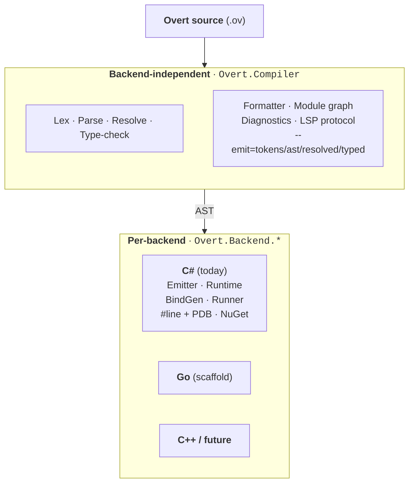

# Overt

An **agent-first programming language** — written, read, and maintained primarily by LLM agents, with humans in a review and audit role. Transpiles to readable source in host languages (C# primary, Go secondary).

The name is the design philosophy: every effect, error, dispatch, mutation, and piece of state is *overt* — visible at the call or declaration site, never concealed from the reader.

> **Status (April 2026):** working end-to-end on C#. An Overt program can transpile, compile, and *run* — including calling arbitrary BCL static methods / properties / fields via `extern "csharp"` — and the ecosystem scaffolding is in place: cross-file modules with dotted paths and aliasing, a blessed stdlib under `stdlib/csharp/*` auto-discovered by the CLI, a reflection-driven facade generator (`overt bind`), a canonical formatter (`overt fmt`, idempotent and comment-preserving), and an `overt run` that in-memory-compiles and invokes `Module.main()`. The type checker rejects 13 classes of error — type mismatches, ignored `Result`s, non-exhaustive match (incl. stdlib `Option`/`Result`), uncovered effect rows (incl. higher-order callbacks), refinement violations at literal boundaries, misplaced loop-control keywords, `for each` on non-`List`. Faithful `?` / `|>?` propagation lowers to early-returns, including inside `if` / `match` arms used as expression values (via statement-level restructuring). Full imperative control flow (`for each`, `loop`, `break`, `continue`, literal patterns in `match`). Every diagnostic auto-appends a `note: see AGENTS.md §N` pointer. 354 tests, covering lexer goldens, emitter compile-checks, formatter idempotence, multi-module graphs, end-to-end BCL calls, and more. Release engineering for Compiler Explorer is staged and waiting on a version tag. Go backend is scaffolded but not emitting.

---

## Why another language?

Every existing programming language is designed for humans. Short names, implicit effects, positional arguments, exceptions that unwind invisibly, and reflection are all accommodations for *human* cognitive limits — small working memory, strong pattern-matching, strong causal intuition.

LLMs have the inverse profile: **large context, weak causal tracking across calls**. A language optimized for agent authorship should invert the usual tradeoffs — trade brevity for signatures that explain themselves, trade inference for types restated at use sites, trade "idiomatic" for one canonical form.

The target is **optimized for the agent, tolerable for the auditor**. A different point on the curve than any existing language.

For the full argument, see [`DESIGN.md`](DESIGN.md) §1–§2.

---

## What it looks like

```overt
module hello

fn main() !{io} -> Result<(), IoError> {
    println("Hello, LLM!")?
    Ok(())
}
```

Key shape rules on display, even in six lines:

- **`!{io}`** — the effect row on the signature. `main` performs I/O; the caller sees that without reading the body.
- **`-> Result<(), IoError>`** — errors are values. No exceptions.
- **`println("...")?`** — the `?` operator propagates failure explicitly. No hidden unwinding.
- **`Ok(())`** — success is constructed, not implicit.

More examples under [`examples/`](examples/): task groups (`parallel`), fallback (`race`), immutable records with `let mut` rebinding and `with` for modified copies, pipe composition (`|>` / `|>?`), exhaustive pattern matching, refinement types, first-class causal traces, and FFI to C#, Go, and C.

---

## Design highlights

A few of the decisions that define the language. Full rationale in [`DESIGN.md`](DESIGN.md).

- **Static, non-nullable types, no reflection, no user-defined macros.** Predictability over cleverness.
- **Errors as values with `Result<T, E>` and `?` propagation** (§11). Exceptions convert only at FFI boundaries.
- **Effect rows declared on every function**, row-polymorphic via effect-row type variables (§7). Core effects: `io`, `async`, `inference`, `fails`.
- **Immutable records.** `let mut` rebinds local names; `with` produces modified copies (§10). No shared mutable state.
- **No method-call syntax.** Pipes (`|>`, `|>?`) for composition; bare calls otherwise (§7). Dots mean field access or module-qualified call, nothing else.
- **No literal integer indexing at source level** (§13). Zero-cost iteration or proven-index as the numeric-kernel escape hatch.
- **Transpile to source, not IR.** C# via Roslyn (primary); Go as conformance target (§18, §20). LLVM explicitly rejected for v1.
- **One canonical form**, enforced by the formatter. No per-project or per-developer style config (§4, §21).
- **Defined behavior, no UB** (§8). Integer overflow traps by default. Every classical UB source from C/C++ is designed out structurally.
- **Runtime errors point at Overt source.** The C# emitter writes `#line` directives so exceptions, debuggers, and stack traces resolve to the original `.ov` file, not the generated `.cs`. Editing the generated code is structurally discouraged — see §18's debug-mapping subsection.

---

## Architecture

Two-tier split: language-level work is shared across all backends; anything that touches host artifacts is per-backend.



See [`DESIGN.md`](DESIGN.md) §19 (stdlib is per-backend, not portable) and §20 (tooling-tier split) for rationale.

## Repository layout

```
DESIGN.md                           Primary design document (source of truth)
AGENTS.md                           Operational reference for agents writing Overt
CARRYOVER.md                        Session handoff — next-session queue and locked decisions
docs/
  grammar/                          Authoritative lexical + precedence grammars
  tooling/                          Compiler Explorer integration plan
examples/                           Example programs — living test cases
stdlib/
  csharp/                           Blessed BCL facades (auto-discovered by CLI)
    system/                           Mirrors .NET's System.* namespace structure
tooling/
  install.ps1                       Publish-and-install script for the `overt` CLI
  ov.ps1                            Dev-mode wrapper that targets the Debug build dir
  godbolt/                          Compiler Explorer submission scaffolding
vscode-extension/                   TextMate grammar + language config for .ov files
src/
  Overt.Compiler/                   Tier 1: lexer, parser, resolver, type-checker, formatter
    Modules/                          Module-graph resolution for cross-file `use`
  Overt.Backend.CSharp/             Tier 2: C# emitter, BindGenerator, extern runtime wiring
  Overt.Backend.Go/                 Tier 2: Go backend (scaffold; no emission yet)
  Overt.Cli/                        Thin dispatcher: `run`, `fmt`, `bind`, `--emit=<stage>`
  Overt.Runtime/                    Runtime prelude for transpiled programs (C# backend)
tests/
  Overt.Tests/                      xUnit suite (354 tests)
  Overt.EndToEnd/                   Roslyn compile + exec harness for hello.ov
```

---

## Building and running

Requires the .NET 9 SDK.

```
dotnet build
dotnet test
```

Tests are comprehensive: lexer token-stream goldens, parser AST shape assertions, name-resolver scoping tests, type-checker annotation tests, C# emitter shape tests, Roslyn-based compile-check for every example, a `#line`-mapping verification, and an end-to-end run of `hello.ov` through the full pipeline.

### The compiler CLI

```
overt run <file.ov>              transpile, compile in memory, execute
overt fmt [--write] <file.ov>    format to canonical form (idempotent)
overt bind --type <FullName>     generate an Overt facade for a .NET type
overt --emit=<stage> <file.ov>   dump a pipeline stage for inspection
```

Emit stages, each writing to stdout with diagnostics on stderr:

- `--emit=tokens` — the lexer's token stream, one per line
- `--emit=ast` — the parsed AST as a readable tree
- `--emit=resolved` — identifier → symbol resolutions
- `--emit=typed` — declaration and expression types
- `--emit=csharp` — transpiled C# source (compiles against [`Overt.Runtime`](src/Overt.Runtime))
- `--emit=go` — not yet implemented

All emit stages (plus `run`) walk the full module graph, so a file with `use` declarations compiles correctly even in stage-dump mode.

Diagnostics follow the `path:line:col: severity: CODE: message` format with `help:` follow-ups (actionable fix) and `note:` follow-ups (pointer into [`AGENTS.md`](AGENTS.md)). Codes are stable: `OV00xx` lex, `OV01xx` parse, `OV02xx` resolve, `OV03xx` type-check.

### Running transpiled programs

```
overt run examples/hello.ov
# -> Hello, LLM!
```

The end-to-end Roslyn compile + exec happens in-process; there is no intermediate file.

### Using blessed stdlib facades

The CLI auto-discovers [`stdlib/csharp/`](stdlib/csharp/) next to the compiler. Overt programs `use` the facades directly:

```overt
module app

use stdlib.csharp.system.environment as env
use stdlib.csharp.system.math as math

fn main() !{io} -> Result<(), IoError> {
    let cpus: Int = env.processor_count()?
    println("cpus=${cpus} sqrt9=${math.sqrt(d = 9.0)}")?
    Ok(())
}
```

To generate a new facade:

```
overt bind --type System.DateTime --module stdlib.csharp.system.datetime \
           --output stdlib/csharp/system/datetime.ov
```

### Installing on PATH

`tooling/install.ps1` publishes the CLI into `$HOME\bin` (or any `-Bin <path>`) and copies the blessed `stdlib/` alongside it. Re-run whenever you want the on-PATH copy to reflect new changes.

---

## Pipeline

The compiler pipeline, with the test coverage that pins each stage:

1. **Lex** (`Syntax/Lexer.cs`) — mode-stack lexer per [`docs/grammar/lexical.md`](docs/grammar/lexical.md). Token streams for every example are locked in golden files under [`tests/Overt.Tests/fixtures/golden/`](tests/Overt.Tests/fixtures/golden/).
2. **Parse** (`Syntax/Parser.cs`) — recursive-descent, precedence per [`docs/grammar/precedence.md`](docs/grammar/precedence.md). All 12 examples produce zero parser diagnostics.
3. **Name-resolve** (`Semantics/NameResolver.cs`) — builds a symbol table, resolves identifier references (including module-qualified names like `List.empty` / `Trace.subscribe`), enforces `DESIGN.md §3`'s no-shadowing rule. Prelude symbols ([`Semantics/Stdlib.cs`](src/Overt.Compiler/Semantics/Stdlib.cs)) are ambient and shadowable. Did-you-mean suggestions via Levenshtein.
4. **Type-check** (`Semantics/TypeChecker.cs`) — lowers the AST into a `TypeRef` IR, annotates every expression, and *validates* contracts. Enforces: argument/return/field/arm/condition/arity type correctness (OV0300–0306), ignored `Result` (OV0307), match exhaustiveness on user enums and stdlib `Option`/`Result` (OV0308), effect-row coverage including higher-order propagation and module-qualified calls (OV0310), and refinement-predicate decidability at literal boundaries (OV0311). Non-generic type aliases are transparent for equality; refinement predicates outside the decidable fragment are quietly deferred to runtime-assertion emission (not yet implemented).
5. **Emit C#** (`Overt.Backend.CSharp/CSharpEmitter.cs`) — walks the AST with the type-checker's annotations and emits C# source text. Expected-type threading propagates target types into generic calls so constructs like `List.empty()`, `Ok(x)`, and variant-pattern matches lower without a full inference pass. `#line` directives map every statement and declaration back to the `.ov` source so PDBs point runtime errors at Overt.
6. **Compile C#** (Roslyn) — verified by the test suite for every example.

---

## How Overt gets built

From [`DESIGN.md §20`](DESIGN.md):

1. **Backend-independent frontend.** Lex / parse / resolve / type-check / format / module graph / diagnostics live in `Overt.Compiler` and never learn which backend will consume the AST.
2. **Per-backend everything else.** Each `Overt.Backend.<Host>` owns its emitter, runtime, binding generator (`overt bind`), runner (`overt run`), debug mapping, and package-ecosystem interop.
3. **C# emission primary** (Roslyn, emitting C# source text — not IL).
4. **Go emission as conformance target** to keep the split honest; CI only, not a parallel implementation effort.
5. **Portability, if ever needed, is its own backend** — a purpose-designed portable stdlib and emitter, opted into explicitly. See §19.

The compiler host language is **C#**, chosen for iteration speed given the primary author's background and the fact that the C# backend depends on Roslyn APIs anyway.

---

## Contributing

Overt is an early-stage solo project. Issues and discussion are welcome, but external PRs are unlikely to be merged until the language stabilizes enough that the bar for changes is clearer than it is today. The living design document is the place to propose a direction; [`examples/`](examples/) is the place to stress-test it.

Locked v1 decisions are enumerated in [`CARRYOVER.md`](CARRYOVER.md). Re-opening them requires new evidence, not new preferences.

---

## License

Apache License 2.0. See [`LICENSE`](LICENSE).
