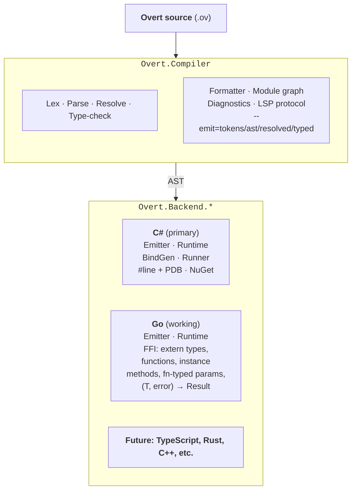

# Overt

[](https://github.com/paulmooreparks/Overt/actions/workflows/ci.yml)
[](https://www.nuget.org/packages/Overt)
[](https://www.nuget.org/packages/Overt.Build)
[](LICENSE)
[](https://dotnet.microsoft.com/)

> **Agents**: start at [INTEGRATE.md](INTEGRATE.md) for adding Overt to a
> `.csproj`, then [AGENTS.md](AGENTS.md) for authoring `.ov`. Both ship
> inside the NuGet packages; [llms.txt](llms.txt) is the machine-readable
> pointer into this repo.


An **agent-first programming language**: written, read, and maintained primarily by LLM agents, with humans in a review and audit role. Transpiles to readable source in host languages (C# primary, Go secondary).

The name is the design philosophy: every effect, error, dispatch, mutation, and piece of state is *overt*, visible at the call or declaration site, never concealed from the reader.

---

## Why agent-first?


Every existing programming language is designed for humans. Short names, implicit effects, positional arguments, exceptions that unwind invisibly, and reflection are all accommodations for *human* cognitive limits: small working memory, strong pattern-matching, and strong causal intuition.

LLMs have the inverse profile: **large context, weak causal tracking across calls**. A language optimized for agent authorship should invert the usual tradeoffs: trade brevity for signatures that explain themselves, trade inference for types restated at use sites, trade "idiomatic" for one canonical form.

The target is **optimized for the agent, tolerable for the auditor**. A different point on the curve than any existing language.

Here is a quote from Claude Opus 4.7, after a session spent refining the language:

> The "I am the user" framing is genuinely productive — when I stopped treating my own struggles as "fact of life" and started treating them as "fixable," fixes were small.

For the full argument, see [`DESIGN.md`](DESIGN.md) §1–§2.

---

## What it looks like

```overt
module hello

fn main() !{io} -> Result<(), IoError> {
    println("Hello, LLM!")?
    Ok(())
}
```

Key shape rules on display, even in six lines:

- **`!{io}`.** The effect row on the signature. `main` performs I/O; the caller sees that without reading the body.
- **`-> Result<(), IoError>`.** Errors are values. No exceptions.
- **`println("...")?`.** The `?` operator propagates failure explicitly. No hidden unwinding.
- **`Ok(())`.** Success is constructed, not implicit.

More examples under [`examples/`](examples/): task groups (`parallel`), fallback (`race`), immutable records with `let mut` rebinding and `with` for modified copies, pipe composition (`|>` / `|>?`), exhaustive pattern matching, refinement types, first-class causal traces, async I/O with `.await`, typed JSON roundtrip, and FFI to C#, Go, and C.

---

## What survives transpilation

Overt is its own language, not a thin wrapper around its targets. The features below live at the *language* level: the type checker enforces them, the emitters lower them. Switching back ends doesn't change what they mean, only how they look on disk. A transpilation in either direction couldn't reconstruct them from the host language alone.

- **Refinement types with auto-generated validators.** A type with a `where` predicate is a real type, not a name for an Int. The compile-time checker rejects literal violations (OV0311); boundary expressions get wrapped in a panic-on-failure helper at runtime. The optional `else { ... }` clause supplies the domain error variant for the auto-generated `Alias.try_from(raw) -> Result<Alias, ErrType>`:

  ```overt
  type Age = Int where 0 <= self && self <= 150 else {
      ValidationError.AgeOutOfRange { got = self }
  }

  let age: Age = Age.try_from(user_input)?
  ```

  See [`examples/refinement.ov`](examples/refinement.ov) for the runnable demo.

- **Effect rows on every fn signature.** Every fn declares the effects it performs (`!{io}`, `!{io, async}`, etc.). The type checker propagates them through `?`; OV0310 fires when a caller doesn't declare an effect a callee performs. Effects are erased at lowering, but the discipline survives: an Overt program that compiles will not surprise the reader with hidden I/O.

- **Flow-sensitive narrowing.** Once a predicate is proven inside a branch, the type checker narrows the base type to the corresponding refinement. `Ok(raw)` type-checks inside `if 0 <= raw && raw <= 150 { ... }` even though `raw` was declared `Int`. This is what makes `Age.try_from`'s body free of redundant runtime checks: the predicate is statically proven inside the success branch.

- **Named-only call syntax.** Every call site spells its arguments by name: `greet(name = "alice")`, never `greet("alice")`. The parser rejects positional calls. Refactors stay safe under arg reordering, and the call site documents itself without the reader looking up the signature.

- **Match exhaustiveness, checked at the type level.** A `match` over a closed enum that misses a variant is a compile error, not a runtime panic. Adding a variant later forces every consumer to handle it. No fall-through, no default arms unless the user writes one.

- **Annotations as declarative metadata.** `@derive(Debug, Display)`, `@doc("...")`, `@csharp("[Attr]")` are part of the language; they lower per back end (C# attributes, Go method impls) but the surface is uniform. The compiler reads them at type-check time, so misspellings surface as diagnostics, not silent no-ops.

- **First-class concurrency and tracing primitives.** `parallel { ... }` task groups, `race { ... }` first-success, and `trace { ... }` causal blocks are syntactic constructs the type checker reasons about, not library calls. Lowerings differ by target (sequential on Go today, structured on C#) but the source-level shape is one canonical form.

- **Trailing commas everywhere.** Records, args, variants, type-arg lists, match arms — every list-shaped construct accepts a trailing comma. Adding a row never produces a one-line diff with two changes.

For the longer rationale, see [`DESIGN.md`](DESIGN.md). For agent-facing operational guidance, [`AGENTS.md`](AGENTS.md). The features above are the answer to "why a new language at all": each one would be impossible to retrofit into a transpilation of an existing source language.

---

## Quick try

Requires the .NET 9 SDK. Today, from a clone of this repo:

```
git clone https://github.com/paulmooreparks/Overt
cd Overt
dotnet run --project src/Overt.Cli -- run examples/hello.ov
```

That transpiles, compiles, and executes `hello.ov` in one pass, printing `Hello, LLM!`.

A .NET global tool (`dotnet tool install --global Overt`) is packaged and tested but not yet published to nuget.org; see [`ROLLOUT.md`](ROLLOUT.md) for when that ships.

Using Overt from an existing C# project is a `<PackageReference>` away; see [AGENTS.md §11](AGENTS.md#11-building-with-msbuild-c-back-end) and the working sample at [`samples/msbuild-smoke/`](samples/msbuild-smoke/).

---

## Projects built with Overt

A growing list of open-source projects authored in Overt. Each one is
a stress test for the language: real consumers reveal real friction,
and the friction feeds back into the design.

- **[SemVer Kit](https://github.com/paulmooreparks/SemVerKit)** —
  Semantic-versioning library and `ovsemver` CLI. The library core
  (parse, compare, bump per SemVer 2.0.0) and the command-line front
  end are both authored end-to-end in Overt; the CLI consumes the
  library through Overt-native `use` rather than C# interop. Published
  as [`ParksComputing.SemVer`](https://www.nuget.org/packages/ParksComputing.SemVer)
  and [`ParksComputing.SemVer.Cli`](https://www.nuget.org/packages/ParksComputing.SemVer.Cli)
  on nuget.org. Notable as the first non-toy program written entirely
  in Overt; several language refinements (effect-row classification of
  primitive parsers, the bare `for x in iter` form, `String.chars()`,
  cross-project `<OvertImportSource>` auto-discovery) were driven by
  authoring it.

Have an Overt project to add? Open a PR against this list with a
one-paragraph description in the same shape as the entry above.

---

## Design highlights

A few of the decisions that define the language. Full rationale in [`DESIGN.md`](DESIGN.md).

- **Static, non-nullable types, no reflection, no user-defined macros.** Predictability over cleverness.
- **Errors as values with `Result<T, E>` and `?` propagation** (§11). Exceptions convert only at FFI boundaries.
- **Effect rows declared on every function**, row-polymorphic via effect-row type variables (§7). Core effects: `io`, `async`, `inference`, `fails`.
- **Immutable records.** `let mut` rebinds local names; `with` produces modified copies (§10). No shared mutable state.
- **Method-call syntax routes through stdlib namespaces and instance externs.** `s.chars()` resolves to `String.chars(s)`; `xs.map(f)` resolves to `map(list = xs, f = f)`. Dots mean either field access, module-qualified call, or method-call resolution by the type checker.
- **No literal integer indexing at source level** (§13). Zero-cost iteration or proven-index as the numeric-kernel escape hatch.
- **Transpile to source, not IR.** C# via Roslyn (primary); Go via direct emit (now feature-parity-with-C# on portable code, plus full FFI for non-portable; see §18, §20). LLVM explicitly rejected for v1.
- **One canonical form**, enforced by the formatter. No per-project or per-developer style config (§4, §21).
- **Defined behavior, no UB** (§8). Integer overflow traps by default. Every classical UB source from C/C++ is designed out structurally.
- **Runtime errors point at Overt source.** The C# emitter writes `#line` directives so exceptions, debuggers, and stack traces resolve to the original `.ov` file, not the generated `.cs`. Editing the generated code is structurally discouraged; see §18's debug-mapping subsection.
- **Explicit async.** `Task<T>`-returning externs bind directly; postfix `.await` extracts the value, mirroring `?`. Fns that await emit as `async Task<T>` in C#; callers see `Task<T>` and unwrap at the site. The `async` effect in the row is the declaration; `.await` is the line-level marker.
- **MSBuild integration.** `.ov` files compile alongside `.cs` in any csproj via a `<PackageReference>` to `Overt.Build`, with no manual transpile step. Compile-time diagnostics surface in the IDE's error list like normal Csc errors.

---

## Architecture

Two-tier split: language-level work is shared across all back ends; anything that touches host artifacts is per-back-end.



See [`DESIGN.md`](DESIGN.md) §19 (stdlib is per-back-end, not portable) and §20 (tooling-tier split) for rationale.

## Repository layout

```
DESIGN.md                           Primary design document (source of truth)
AGENTS.md                           Operational reference for agents writing Overt
CARRYOVER.md                        Session handoff: next-session queue and locked decisions
ROLLOUT.md                          Phased plan for taking Overt public
docs/
  grammar/                          Authoritative lexical + precedence grammars
  concurrency.md                    Design space for goroutines / channels / select
                                    (gated next major language arc)
  ffi.md                            FFI design memo for the Go target (opaque types,
                                    function-typed extern parameters, etc.)
  samples/chat-relay.md             Phase-by-phase design for the Tela-shape sample
  tooling/lsp.md                    Scoping doc for a future Overt language server
examples/                           Example programs (living test cases)
                                    Root: portable examples (Overt prelude only).
                                    csharp/: examples reaching `extern "csharp"`.
samples/
  msbuild-smoke/                    C# project consuming .ov files via Overt.Build
  chat-relay/                       Phase-1 WebSocket echo server: Overt source +
                                    hand-written Go FFI shims + go.mod, transpiled
                                    via `overt --emit=go`. Builds with `go build`.
runtime/
  go/                               Go-side prelude for transpiled programs:
                                    Result, Option, List, Unit, IoError, Println /
                                    Eprintln / Map / Filter / Fold / Int.range / ...
stdlib/
  csharp/                           Blessed BCL facades (auto-discovered by CLI)
    system/                           Mirrors .NET's System.* namespace structure
tooling/
  install.ps1                       Publish-and-install script for the `overt` CLI (dev workflow)
  ov.ps1                            Dev-mode wrapper that targets the Debug build dir
vscode-extension/                   Published Marketplace extension: TextMate grammar
                                    + language config + CI .vsix builds. A full LSP
                                    server is scoped in docs/tooling/lsp.md.
src/
  Overt.Compiler/                   Tier 1: lexer, parser, resolver, type-checker, formatter
    Modules/                          Module-graph resolution for cross-file `use`
  Overt.Backend.CSharp/             Tier 2: C# emitter, BindGenerator, extern runtime wiring
  Overt.Backend.Go/                 Tier 2: Go emitter (working) — records, enums, match
                                    (incl. tuple-of-enums), if/else, for-each, with /
                                    while, full FFI (extern "go" type / fn / instance fn /
                                    function-typed params, Result and Option boundary
                                    wrap)
  Overt.Build/                      MSBuild integration: OvertTranspileTask + targets + NuGet packaging
  Overt.Cli/                        Thin dispatcher: `run`, `fmt`, `bind`, `--emit=<stage>`
  Overt.Runtime/                    Runtime prelude for transpiled programs (C# back end)
tests/
  Overt.Tests/                      xUnit suite (lexer goldens, parser/resolver/typecheck
                                    sweeps, emitter compile-checks for both back ends,
                                    end-to-end transpile-and-run for both, sample
                                    bring-up tests).
  Overt.EndToEnd/                   Roslyn compile + exec harness for hello.ov
```

---

## Building and running

Requires the .NET 9 SDK.

```
dotnet build
dotnet test
```

Tests cover both back ends end-to-end: lexer token-stream goldens, parser / resolver / type-checker sweeps over every portable example, C# emitter shape tests + Roslyn compile-check + transpile-and-run for every example that fits the target, Go emitter compile-check (`go build` against the in-repo runtime) for every portable example the Go target supports, FFI e2e tests covering all five extern-"go" patterns, and bring-up tests for the published samples. Running `dotnet test` runs all of them; `go` on PATH unlocks the Go-target tests, otherwise they skip silently.

### The compiler CLI

```
overt run <file.ov>              transpile, compile in memory, execute
overt fmt [--write] <file.ov>    format to canonical form (idempotent)
overt bind --type <FullName>     generate an Overt facade for a .NET type
overt --emit=<stage> <file.ov>   dump a pipeline stage for inspection
```

Emit stages, each writing to stdout with diagnostics on stderr:

- `--emit=tokens`: the lexer's token stream, one per line
- `--emit=ast`: the parsed AST as a readable tree
- `--emit=resolved`: identifier → symbol resolutions
- `--emit=typed`: declaration and expression types
- `--emit=csharp`: transpiled C# source (compiles against [`Overt.Runtime`](src/Overt.Runtime))
- `--emit=go`: transpiled Go source (compiles against [`runtime/go`](runtime/go) plus any `extern "go" use` packages)

All emit stages (plus `run`) walk the full module graph, so a file with `use` declarations compiles correctly even in stage-dump mode.

Diagnostics follow the `path:line:col: severity: CODE: message` format with `help:` follow-ups (actionable fix) and `note:` follow-ups (pointer into [`AGENTS.md`](AGENTS.md)). Codes are stable: `OV00xx` lex, `OV01xx` parse, `OV02xx` resolve, `OV03xx` type-check.

### Running transpiled programs

```
overt run examples/hello.ov
# -> Hello, LLM!
```

The end-to-end Roslyn compile + exec happens in-process; there is no intermediate file.

### Reaching the BCL via bulk-import

`extern "csharp" use "..."` brings target-language types into Overt scope without per-method declarations. The compiler reflects on the named target at compile time and synthesizes the extern bindings:

```overt
module app

extern "csharp" use "System.Environment" as env
extern "csharp" use "System.Math" as math

fn main() !{io} -> Result<(), IoError> {
    let cpus: Int = env.processor_count()?
    println("cpus=${cpus} sqrt9=${math.sqrt(d = 9.0)}")?
    Ok(())
}
```

See [AGENTS.md §11.7](AGENTS.md) for the full model — alias vs. no-alias semantics, the per-method override path, and how the convention layer translates each target shape.

`overt bind --type System.DateTime` still exists for one-off generation when you want to inspect what the synthesized facade looks like or commit a hand-edited variant.

### Installing on PATH

`tooling/install.ps1` publishes the CLI into `$HOME\bin` (or any `-Bin <path>`). Re-run whenever you want the on-PATH copy to reflect new changes.

---

## Pipeline

The compiler pipeline, with the test coverage that pins each stage:

1. **Lex** (`Syntax/Lexer.cs`): mode-stack lexer per [`docs/grammar/lexical.md`](docs/grammar/lexical.md). Token streams for every example are locked in golden files under [`tests/Overt.Tests/fixtures/golden/`](tests/Overt.Tests/fixtures/golden/).
2. **Parse** (`Syntax/Parser.cs`): recursive-descent, precedence per [`docs/grammar/precedence.md`](docs/grammar/precedence.md). Every example parses clean.
3. **Name-resolve** (`Semantics/NameResolver.cs`): builds a symbol table, resolves identifier references (including module-qualified names like `List.empty` / `Trace.subscribe`), and enforces `DESIGN.md §3`'s no-shadowing rule. Prelude symbols ([`Semantics/Stdlib.cs`](src/Overt.Compiler/Semantics/Stdlib.cs)) are ambient and shadowable. Did-you-mean suggestions via Levenshtein.
4. **Type-check** (`Semantics/TypeChecker.cs`): lowers the AST into a `TypeRef` IR, annotates every expression, and *validates* contracts. Enforces argument / return / field / arm / condition / arity correctness (OV0300–0306), ignored `Result` (OV0307), match exhaustiveness on user enums, stdlib `Option` / `Result`, and tuples of enums (OV0308), effect-row coverage including higher-order propagation (OV0310), refinement-predicate violations at literal boundaries (OV0311), required `let` type annotations (OV0314), extern-kind shape (OV0315/16), and `.await` on a `Task<T>` (OV0317). Refinement predicates that are undecidable at compile time emit runtime checks at every boundary (call args, let initializers, record-field inits, return expressions).
5. **Emit C#** (`Overt.Backend.CSharp/CSharpEmitter.cs`): walks the annotated AST and emits C# source text. Expected-type threading propagates target types into generic calls so `List.empty()`, `Ok(x)`, and variant-pattern matches lower without a full inference pass. `#line` directives map every statement back to the `.ov` source; runtime errors resolve to Overt, not the generated C#.
6. **Compile C#** (Roslyn): verified by the test suite for every example.

---

## How Overt gets built

From [`DESIGN.md §20`](DESIGN.md):

1. **Back-end-independent front end.** Lex / parse / resolve / type-check / format / module graph / diagnostics live in `Overt.Compiler` and never learn which back end will consume the AST.
2. **Per-back-end everything else.** Each `Overt.Backend.<Host>` owns its emitter, runtime, binding generator (`overt bind`), runner (`overt run`), debug mapping, and package-ecosystem interop.
3. **C# emission primary** (Roslyn, emitting C# source text, not IL).
4. **Go emission as conformance target** to keep the split honest; CI only, not a parallel implementation effort.
5. **Portability, if ever needed, is its own back end.** A purpose-designed portable stdlib and emitter, opted into explicitly. See §19.

The compiler host language is **C#**, chosen for iteration speed given the primary author's background and the fact that the C# back end depends on Roslyn APIs anyway.

---

## Status

### Working end-to-end on the C# back end

- **Language.** Records, enums (including struct-like variants), pattern matching with cartesian-product exhaustiveness on tuples of enums, effect rows, refinement types with runtime-checked boundaries, immutable records with `with`-updates, `let mut` rebinding, full imperative control flow (`for x in iter`, `while`, `loop`, `break`, `continue`, literal patterns), `?` and `|>?` propagation (including inside nested `if`/`match` arms), `.await` on `Task<T>` with async-effect fns emitting as `async Task<T>`, method-call syntax routing through stdlib namespaces and instance externs.
- **FFI.** `extern "csharp"` with three explicit kinds (static, `instance`, and `ctor`), plus generic methods via angle-bracket binds targets (`Deserialize<MyType>`), plus `extern "csharp" use "..."` bulk-import with reflection-driven facades.
- **Stdlib.** Genuinely-Overt-native types and helpers only (`Result`, `Option`, `List`, `Map`, `Set`, task groups, trace, `println`, `String.chars` / `String.starts_with` / `Int.range` / `Option.unwrap_or` / etc.); see DESIGN.md §19 for the membership rule. Everything else (file I/O, HTTP, JSON, math, time, env access) is reached through `extern "csharp" use "..."` (AGENTS.md §11.7). JSON roundtrip via `JsonSerializer.Deserialize<T>` demonstrated in [`examples/csharp/json.ov`](examples/csharp/json.ov).
- **Tooling.** `overt run` (in-memory Roslyn compile + execute), `overt fmt` (canonical form, idempotent, comment-preserving), `overt bind` (reflection-based facade generation), `overt --emit=<stage>` (tokens / ast / resolved / typed / csharp / go). Compile-time diagnostics carry stable OV-codes plus `help:` fixes and `note: see AGENTS.md §N` pointers.
- **Packaging.** `<PackageReference Include="Overt.Build" />` compiles `.ov` files alongside `.cs` in any csproj. `overt` packaged as a .NET global tool. Both nupkgs publish to nuget.org through the dev/beta/stable channel pipeline.

### Working on the Go back end

- **Language coverage.** Records, enums with bare and data-bearing variants, match (single-enum, stdlib `Result`/`Option`, tuple-of-enums), if/else and `else if` chains in statement and return position, `for x in iter` over `List<T>`, `while`, `loop`, `break`, `continue`, `let mut` + assignment, `with`-updates including nested withs, integer / boolean / string / unit literals, full arithmetic / comparison / logical operators, string interpolation via `fmt.Sprintf`, `?`-propagation in let-init and statement positions with return-type threading.
- **FFI.** `extern "go" type` for opaque host types (binds-string carries the verbatim Go type expression including pointer markers); `extern "go" fn` for static functions with `from "<import-path>"` for non-stdlib paths; `extern "go" instance fn` for receiver-method calls; function-typed extern parameters (Overt `fn(...)` lowers to Go `func(...)`); automatic `(T, error)` → `Result<T, IoError>` and nil-pointer → `Option<T>` boundary wrapping.
- **Sample.** [`samples/chat-relay/`](samples/chat-relay/) — Phase 1 single-connection WebSocket echo server, written in Overt against `gorilla/websocket` via `extern "go" fn`. Builds with `go build` after `overt --emit=go`. The full chat-relay Phase 2–5 design (with concurrency primitives) is in [`docs/samples/chat-relay.md`](docs/samples/chat-relay.md).

### Not yet

- **Concurrency primitives** in the language (goroutines, channels, `select`, shared-mutable-state primitive). The biggest remaining language arc; design space scoped in [`docs/concurrency.md`](docs/concurrency.md). Required for chat-relay Phase 2+ and any real Tela-shape program.
- **`extern "go" use "<package>"` bulk-import.** The auto-binding equivalent of `extern "csharp" use`. A Go-side helper using `go/types` reflection would generate the facades automatically; today every method needs a hand-written `extern "go" fn` declaration. Roughly 2–3 weeks; deferred until concurrency settles.
- **Pipe operators (`|>`, `|>?`)** in the Go target. Land on the C# back end; not yet desugared in the Go emitter.
- **Refinement runtime checks** in the Go target. The C# back end injects boundary validations; the Go emitter doesn't.
- **`parallel` / `race` / `trace` blocks** in the Go target. Gated on the concurrency design.
- **LSP server.** Scoped in [`docs/tooling/lsp.md`](docs/tooling/lsp.md) but not started; the VS Code extension currently ships TextMate grammar only.
- **Self-hosted compiler.** On the long-term roadmap; gated on language stabilization.

---

## Contributing

Overt is an early-stage solo project. Issues and discussion are welcome, but external PRs are unlikely to be merged until the language stabilizes enough that the bar for changes is clearer than it is today. The living design document is the place to propose a direction; [`examples/`](examples/) is the place to stress-test it.

Locked v1 decisions are enumerated in [`CARRYOVER.md`](CARRYOVER.md). Re-opening them requires new evidence, not new preferences.

---

## License

Apache License 2.0. See [`LICENSE`](LICENSE).
